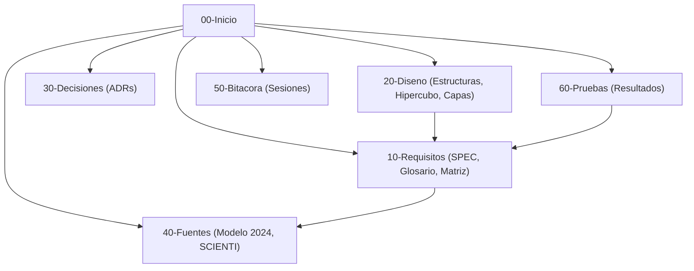

# Bóveda de Documentación Viva · PEA-i

Bienvenido a la bóveda Obsidian de **PEA-i** (Programa Estadístico de Análisis de Investigación - Taller 2 de Estructura de Datos, Universidad Popular del Cesar).

Esta bóveda constituye la única casa de la documentación viva del proyecto, gobernando todas las decisiones de diseño, requisitos, arquitectura, pruebas y evolución conforme al contrato de `AGENTS.md`.

---

## 1. Módulos y Navegación Principal

---

## 2. Mapa Detallado de la Bóveda

### 00. Paneles y Vistas Dinámicas
- Tablero de Bitácoras: `brain/00-Paneles/Bitacora.base`
- Tablero de Decisiones (ADR): `brain/00-Paneles/Decisiones.base`
- Tablero de Requisitos: `brain/00-Paneles/Requisitos.base`

### 10. Requisitos del Sistema
- **Índice de Requisitos**: [[10-Requisitos/_Indice|_Indice de Requisitos]]
- **Especificación Formal**: [[SPEC]]
- **Glosario Oficial**: [[Glosario]]
- **Variables de Entrada y Salida**: [[Variables-entrada-salida]]
- **Historias de Usuario**: [[Historias-de-usuario]]
- **Casos de Uso**: [[Casos-de-uso]]
- **Matriz de Trazabilidad**: [[Matriz-modelo-requisitos]]
- **Preguntas Abiertas y Decisiones Pendientes**: [[Preguntas-abiertas]]

### 20. Arquitectura y Diseño
- Diseños de capas, estructuras hechas a mano y protocolos: `brain/20-Diseno/`

### 30. Registro de Decisiones de Arquitectura (ADR)
- Decisiones consecutivas numeradas sin huecos: `brain/30-Decisiones/`

### 40. Fuentes de Verdad y Corpus Normativo
- **Índice de Fuentes**: [[40-Fuentes/_Indice|_Indice de Fuentes]]
- **Índice del Modelo 2024**: [[Modelo-2024-indice]]
- **Modelo Organizado (Entidades y Citas)**: [[Modelo]]
- **Texto Oficial Íntegro (252 páginas)**: [[Modelo-2024-original]]
- **Notas Temáticas del Modelo 2024**:
  - Investigadores: [[Modelo-Investigadores]]
  - Grupos de Investigación: [[Modelo-Grupos]]
  - Productos y Ponderaciones: [[Modelo-Productos]]
  - Áreas OCDE: [[Modelo-Areas-OCDE]]
  - Estadísticas y Perfiles: [[Modelo-Estadisticas]]
  - Guías de Revisión Documental: [[Modelo-Guias-Revision]]
- **Capturas y Mapeo SCIENTI (GrupLAC y CvLAC)**:
  - GrupLAC (Público): [[SCIENTI-GrupLAC]]
  - CvLAC (Público): [[SCIENTI-CvLAC]]
  - Mapa de Campos SCIENTI: [[SCIENTI-Mapa-de-campos]]
  - Informe de Extracción y Auditoría: [[SCIENTI-Informe-extraccion]]

### 50. Bitácora de Sesiones
- Registro cronológico de actividades: `brain/50-Bitacora/`

### 60. Pruebas y Evidencias
- Informes de verificación y aceptación: `brain/60-Pruebas/`

### 70. Manuales de Usuario e Instalación
- Guías operativas para Windows: `brain/70-Manuales/`

### 90. Plantillas Oficiales
- Plantillas estándar para notas: `brain/90-Plantillas/`
