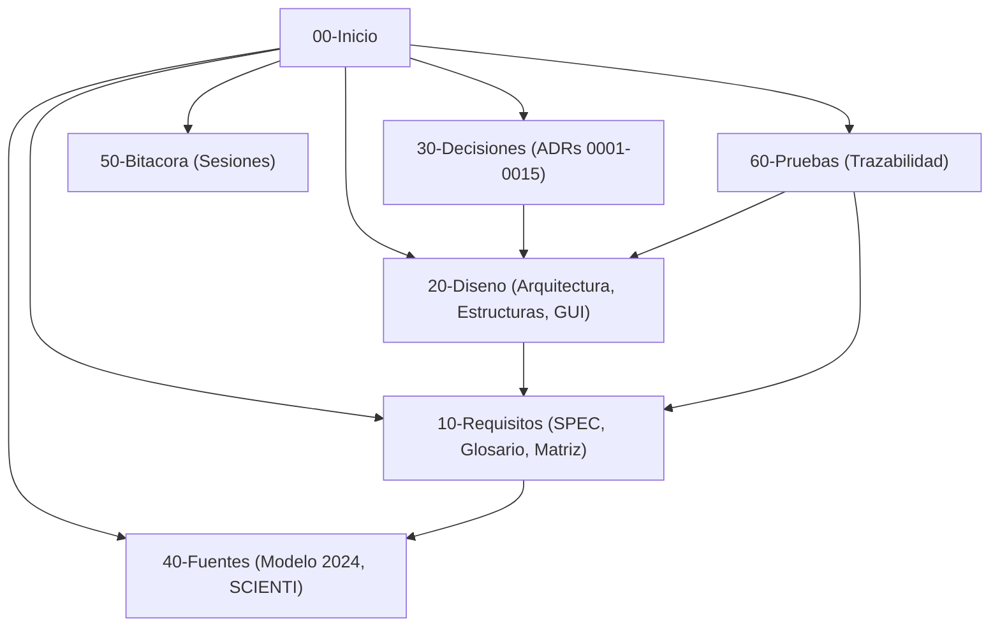

# Bóveda de Documentación Viva · PEA-i

Bienvenido a la bóveda Obsidian de **PEA-i** (Programa Estadístico de Análisis de Investigación - Taller 2 de Estructura de Datos, Universidad Popular del Cesar).

Esta bóveda constituye la única casa de la documentación viva del proyecto, gobernando todas las decisiones de diseño, requisitos, arquitectura, pruebas y evolución conforme al contrato de `AGENTS.md`.

---

## 1. Módulos y Navegación Principal

---

## 2. Mapa Detallado de la Bóveda

### 00. Paneles y Vistas Dinámicas
- Tablero de Bitácoras: `brain/00-Paneles/Bitacora.base`
- Tablero de Decisiones (ADR): `brain/00-Paneles/Decisiones.base`
- Tablero de Requisitos: `brain/00-Paneles/Requisitos.base`

### 10. Requisitos del Sistema
- **Índice de Requisitos**: [[10-Requisitos/_Indice|_Indice de Requisitos]]
- **Especificación Formal**: [[SPEC]]
- **Glosario Oficial**: [[Glosario]]
- **Variables de Entrada y Salida**: [[Variables-entrada-salida]]
- **Historias de Usuario**: [[Historias-de-usuario]]
- **Casos de Uso**: [[Casos-de-uso]]
- **Matriz de Trazabilidad Requisitos/Modelo**: [[Matriz-modelo-requisitos]]
- **Preguntas Abiertas y Decisiones Pendientes**: [[Preguntas-abiertas]]

### 20. Arquitectura y Diseño Formal
- **Índice de Diseño**: [[20-Diseno/_Indice|_Indice de Arquitectura y Diseno]]
- **Flujo en Capas y Compensación**: [[Arquitectura]]
- **Modelo de Dominio y Cardinalidades**: [[Modelo-de-dominio]]
- **Estructuras Hechas a Mano**: [[Estructuras]]
- **Multilista Ortogonal y Nodo Único Compartido**: [[Multilista]]
- **Hipercubo 5D para Estadísticas en Memoria**: [[Hipercubo]]
- **Pila de Deshacer (LIFO)**: [[Pila-deshacer]]
- **Cola de Importación (FIFO)**: [[Cola-importacion]]
- **Contrato de Persistencia y Concurrencia**: [[Contrato-de-datos]]
- **Interoperabilidad y Paridad Python / C++**: [[Interoperabilidad]]
- **Pipeline de Ingesta (Web SCIENTI / CSV)**: [[Ingesta]]
- **Especificación UX/UI y Paridad Visual**: [[GUI-paridad]]
- **Seguridad, Credenciales y Entorno Único**: [[Seguridad-y-credenciales]]
- **Estrategia de Despliegue y Empaquetado Windows**: [[Despliegue]]

### 30. Registro de Decisiones de Arquitectura (ADR)
- **Índice de Decisiones**: [[30-Decisiones/_Indice|_Indice de Decisiones]]
- Decisiones Aprobadas (ADR-0001 a ADR-0015):
  - [[ADR-0001-Boveda-viva]]: Bóveda viva Obsidian como única fuente documental.
  - [[ADR-0002-Unico-proyecto-Supabase]]: Proyecto único con particionamiento lógico para pruebas.
  - [[ADR-0003-Corpus-fiel-del-Modelo]]: Corpus fiel e inmutable del Modelo Minciencias 2024.
  - [[ADR-0004-Privacidad-de-fuentes-reales]]: Privacidad de datos personales de investigadores.
  - [[ADR-0005-Multilista-producto-compartido]]: Multilista con nodo único compartido de producto.
  - [[ADR-0006-Hipercubo-estadisticas-en-memoria]]: Cálculo estadístico exclusivo en Hipercubo 5D en memoria.
  - [[ADR-0007-Compensacion-de-persistencia-reversion]]: Patrón local primero con compensación y reversión.
  - [[ADR-0008-Modelo-de-autenticacion-y-rls]]: Modelo de autenticación con Supabase Auth y RLS.
  - [[ADR-0009-RPC-y-control-de-revision-optimista]]: Funciones RPC y bloqueo optimista por revisión.
  - [[ADR-0010-Limites-y-responsabilidad-de-ingesta]]: Límites éticos y responsabilidad en ingesta web.
  - [[ADR-0011-Paridad-arquitectural-Python-Cpp]]: Paridad arquitectural y funcional estricta Python/C++.
  - [[ADR-0012-Diseno-GUI-y-navegacion]]: Diseño visual institucional y ergonomía en cuatro zonas.
  - [[ADR-0013-Vistas-secundarias]]: Integración de vistas secundarias (historial, cola, gestión).
  - [[ADR-0014-Nomenclatura-del-dominio-y-base-de-datos]]: Nomenclatura del dominio en español y API snake_case.
  - [[ADR-0015-Analisis-de-red-nativo]]: Renderizado nativo del grafo de red de coautoría.

### 40. Fuentes de Verdad y Corpus Normativo
- **Índice de Fuentes**: [[40-Fuentes/_Indice|_Indice de Fuentes]]
- **Índice del Modelo 2024**: [[Modelo-2024-indice]]
- **Modelo Organizado (Entidades y Citas)**: [[Modelo]]
- **Texto Oficial Íntegro (252 páginas)**: [[Modelo-2024-original]]
- **Notas Temáticas del Modelo 2024**:
  - Investigadores: [[Modelo-Investigadores]]
  - Grupos de Investigación: [[Modelo-Grupos]]
  - Productos y Ponderaciones: [[Modelo-Productos]]
  - Áreas OCDE: [[Modelo-Areas-OCDE]]
  - Estadísticas y Perfiles: [[Modelo-Estadisticas]]
  - Guías de Revisión Documental: [[Modelo-Guias-Revision]]
- **Capturas y Mapeo SCIENTI (GrupLAC y CvLAC)**:
  - GrupLAC (Público): [[SCIENTI-GrupLAC]]
  - CvLAC (Público): [[SCIENTI-CvLAC]]
  - Mapa de Campos SCIENTI: [[SCIENTI-Mapa-de-campos]]
  - Informe de Extracción y Auditoría: [[SCIENTI-Informe-extraccion]]

### 50. Bitácora de Sesiones
- Registro cronológico de actividades: `brain/50-Bitacora/`
- Auditoría Integral del Diseño: `brain/50-Bitacora/AUDITORIA-DISENO-PEAI.md`

### 60. Pruebas, Verificación y Trazabilidad
- **Índice de Pruebas**: [[60-Pruebas/_Indice|_Indice de Pruebas]]
- **Matriz de Trazabilidad Integral**: [[Trazabilidad]]

### 70. Manuales de Usuario e Instalación
- Guías operativas para Windows: `brain/70-Manuales/`

### 90. Plantillas Oficiales
- Plantillas estándar para notas: `brain/90-Plantillas/`
