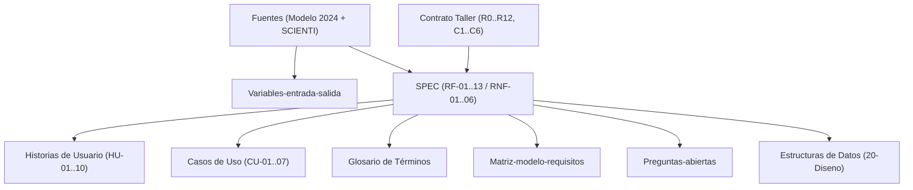

# Índice de Requisitos del Sistema · PEA-i

Este módulo alberga la especificación formal de requisitos que gobierna el desarrollo arquitectural y funcional de **PEA-i**. Todos los requisitos están estrictamente enlazados con los puntos del taller (**R0–R12**, **C1–C6**), el **Modelo Minciencias 2024** y las fuentes de datos **SCIENTI**.

---

## 1. Documentos del Módulo

| Documento | Descripción | Tipo | Estado |
|---|---|---|---|
| [[SPEC]] | Especificación formal de Requisitos Funcionales (RF) y No Funcionales (RNF), trazabilidad R0-R12 / C1-C6 y criterios de aceptación comprobables. | `requisito` | Aprobado |
| [[Glosario]] | Definiciones canónicas de términos del dominio Minciencias, estructuras de datos hechas a mano y conceptos arquitecturales. | `requisito` | Aprobado |
| [[Variables-entrada-salida]] | Diccionario exhaustivo de atributos y campos de Grupos, Investigadores, Integrantes, Productos y Métricas del Hipercubo (con citas y selectores). | `requisito` | Aprobado |
| [[Historias-de-usuario]] | Historias de usuario estructuradas por roles (Investigador, Líder de Grupo, Directivo de Investigación, Administrador) con criterios de aceptación. | `historia-de-usuario` | Aprobado |
| [[Casos-de-uso]] | Especificación detallada de casos de uso del sistema (CU-01 a CU-07) con flujos principales, alternativos, excepciones y reversión. | `caso-de-uso` | Aprobado |
| [[Matriz-modelo-requisitos]] | Matriz de trazabilidad cruzada integral: Taller (R/C) ↔ RF/RNF ↔ Modelo 2024 ↔ SCIENTI ↔ Estructuras de datos ↔ Pruebas. | `requisito` | Aprobado |
| [[Preguntas-abiertas]] | Registro formal de incertidumbres, supuestos de diseño y decisiones pendientes sometidas a consideración del usuario. | `requisito` | Borrador |

---

## 2. Mapa Conceptual de Trazabilidad

