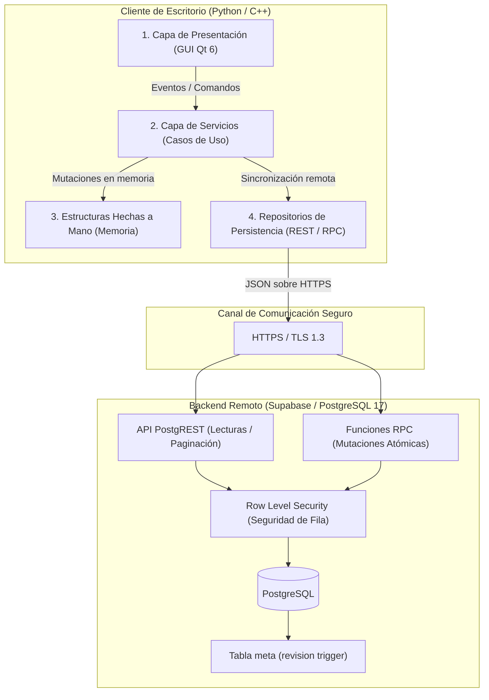
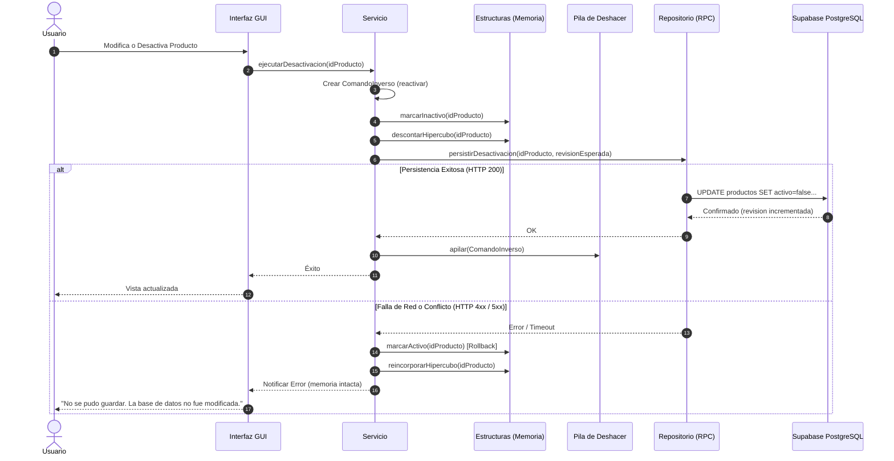

# Diseño · Arquitectura Canónica del Sistema

## 1. Propósito

Esta nota formaliza la arquitectura por capas desacoplada que rige tanto la implementación en **Python 3.12 (PySide6)** como en **C++17 (Qt 6 Widgets)** para el sistema **PEA-i**. Define el flujo de datos unidireccional, las responsabilidades por nivel y las garantías de aislamiento entre la interfaz de usuario, las estructuras de datos en memoria y la persistencia remota en Supabase.

---

## 2. Diagrama General de Capas

---

## 3. Responsabilidades por Capa

### Capa 1: Presentación (GUI)
- **Tecnologías**: PySide6 (Python) y Qt 6 Widgets (C++).
- **Regla Estricta**: La GUI desconoce absolutamente la existencia de SQL, PostgreSQL, PostgREST o la red. No almacena estado de dominio ni manipula directamente punteros de las estructuras de datos.
- **Interacción**: Captura eventos del usuario (clic, texto, selección), invoca métodos asíncronos o sincrónicos de la capa de Servicios, y renderiza modelos de vista (tablas, tarjetas, gráficos de tipología y grafos de coautoría).
- **Manejo de Errores**: Presenta cuadros de diálogo informativos, barras de advertencia no bloqueantes y diálogos de resolución de conflictos de concurrencia.

### Capa 2: Servicios (Lógica de Negocio y Coordinación)
- **Componentes**: `ServicioGrupos`, `ServicioInvestigadores`, `ServicioProductos`, `ServicioEstadisticas`, `ServicioIngesta`, `ServicioSincronizacion`.
- **Responsabilidades**:
  1. Ejecutar las reglas del Modelo Minciencias 2024 (existencia de líder, coherencia de fechas, categorías válidas).
  2. Coordinar la mutación de las estructuras de datos en memoria.
  3. Registrar en la `Pila` de deshacer el comando inverso correspondiente (*Delta Inverso*).
  4. Enviar la persistencia hacia los Repositorios.
  5. **Compensación transaccional**: Si la persistencia remota falla, revierte inmediatamente la mutación en la estructura en memoria y notifica a la GUI.
  6. Consultar periódicamente y validar `meta.revision` antes de persistir mutaciones.

### Capa 3: Estructuras de Datos Hechas a Mano (Memoria Maestra)
- **Componentes**: `ListaDoble<Grupo>`, `ListaDoble<Investigador>`, `Multilista` (para nodos `Producto`), `Pila<ComandoInverso>`, `Cola<TareaIngesta>`, `Hipercubo`.
- **Regla Estricta**: Las entidades de dominio en memoria viven **exclusivamente** en estas estructuras. Queda terminantemente prohibido utilizar contenedores estándar nativos (`list`, `dict`, `std::vector`, `std::map`) como almacén maestro de datos.
- **Rendimiento**: Inserciones O(1), eliminaciones O(1) de nodo conocido en la lista y cálculos analíticos en memoria sin consultar la red.

### Capa 4: Repositorios (Persistencia REST y RPC)
- **Componentes**: `RepositorioREST`, `RepositorioRPC`, `MonitorRevision`.
- **Responsabilidades**:
  1. `RepositorioREST`: Ejecuta lecturas paginadas (límite de 1000 filas por petición de PostgREST) y mutaciones simples mediante verbos HTTP (GET, POST, PATCH, DELETE).
  2. `RepositorioRPC`: Invoca procedimientos almacenados PostgreSQL (`/rpc/<funcion>`) para mutaciones compuestas atómicas (ej. crear producto con coautores y vínculos a grupo). Envía `revision_esperada` para control de concurrencia optimista.
  3. `MonitorRevision`: Consulta periódica del contador `meta.revision`.

### Capa 5: Backend en la Nube (Supabase / PostgreSQL 17)
- **Proyecto Único**: `pea-prod` (URL remota compartida por ambas aplicaciones).
- **Seguridad**: Autenticación de usuario con Supabase Auth y políticas de Row Level Security (RLS) en todas las tablas maestras. Los clientes utilizan exclusivamente la clave pública (*publishable key*). Queda prohibida la clave `service_role`.
- **Aislamiento de Pruebas**: Modo de prueba operando sobre el mismo proyecto, restringido a registros con `es_ejemplo = true` y prefijo `PRUEBA-`.

---

## 4. Flujo Transaccional y Compensación ante Fallos

El sistema aplica el principio de **mutación local con confirmación remota y compensación ante fallo**:

---

## 5. Decisiones Relacionadas
- [[ADR-0001-Boveda-viva]]
- [[ADR-0002-Unico-proyecto-Supabase]]
- [[ADR-0005-Multilista-producto-compartido]]
- [[ADR-0006-Hipercubo-estadisticas-en-memoria]]
- [[ADR-0007-Compensacion-de-persistencia-reversion]]
- [[ADR-0009-RPC-y-control-de-revision-optimista]]
- [[ADR-0011-Paridad-arquitectural-Python-Cpp]]

---

## 6. Riesgos y Casos Borde
- **Corte de red a mitad de persistencia**: La transacción remota se cancela por atomicidad en PostgreSQL y la capa de servicios revierte el cambio en memoria, garantizando cero divergencias.
- **Conflicto de revisión concurrente**: Si otro cliente escribió antes, la llamada RPC aborta por `revision_esperada != meta.revision`, impidiendo la sobreescritura accidental.
