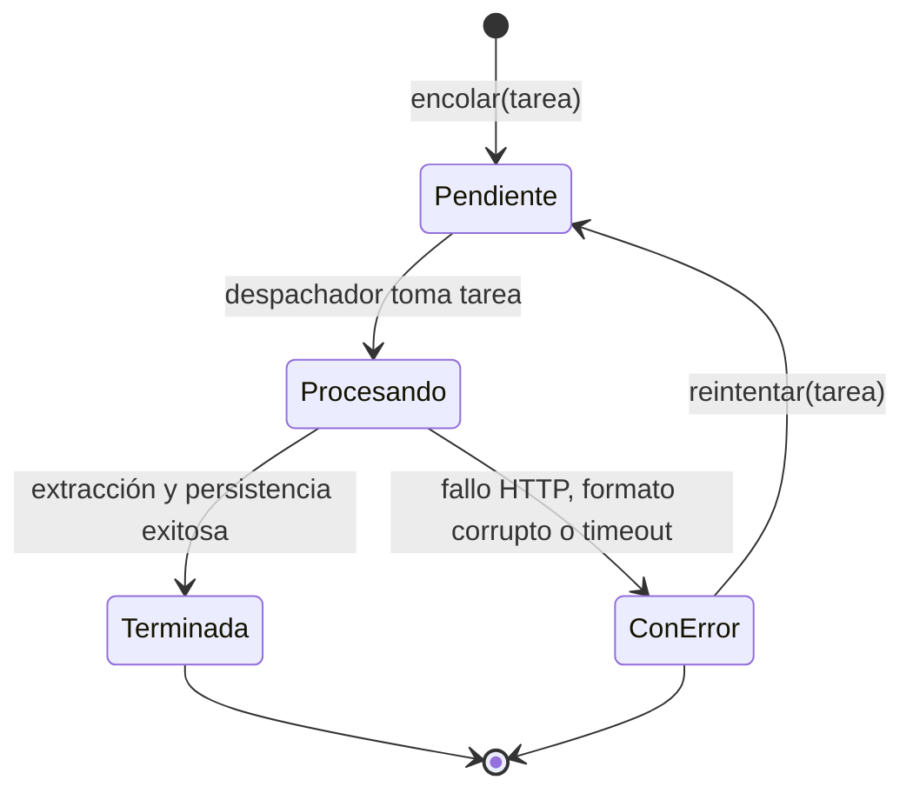

# Diseño · Cola de Importación y Procesamiento por Lotes

## 1. Propósito

Esta nota formaliza el diseño de la estructura de datos **Cola (FIFO)** hecha a mano y su despachador asíncrono en segundo plano, encargado de gestionar las solicitudes de ingesta e importación masiva de datos desde plataformas web (GrupLAC/CvLAC) o archivos locales (CSV canónico).

---

## 2. Máquina de Estados de la Tarea de Ingesta

Cada elemento ingresado a la cola representa una `TareaIngesta` que transita por un ciclo de vida formal y predecible:

### Definición de Estados
- **`Pendiente`**: La tarea fue registrada por el usuario y espera turno en la cola.
- **`Procesando`**: El hilo de trabajo (*worker thread*) está ejecutando la descarga o lectura del recurso.
- **`Terminada`**: Los datos fueron analizados, normalizados, cargados en las estructuras y persistidos en Supabase.
- **`ConError`**: Ocurrió un fallo irrecuperable (código HTTP 404/500 tras 3 reintentos, error de sintaxis en CSV). Se registra la traza de error sin interrumpir las demás tareas encoladas.

---

## 3. Especificación Técnica de la Cola FIFO

### 3.1 Estructura del Nodo y Métodos
- **`NodoCola<T>`**:
  - `dato: T` (instancia de `TareaIngesta`).
  - `siguiente: NodoCola<T>*` (puntero al siguiente elemento detrás en la cola).
- **`Cola<T>`**:
  - `frente: NodoCola<T>*` (primer elemento a ser atendido).
  - `final: NodoCola<T>*` (último elemento insertado).
  - `tamano: int` (cantidad de tareas en espera o proceso).

### 3.2 Invariantes de la Cola
1. La inserción (`encolar`) ocurre siempre por el extremo `final` en tiempo constante $O(1)$.
2. La extracción (`desencolar`) ocurre siempre por el extremo `frente` en tiempo constante $O(1)$.
3. Si `tamano == 0` $\iff$ `frente == null` $\land$ `final == null`.
4. **Principio de No Bloqueo**: El fallo o interrupción de una tarea encolada **jamás** bloquea el procesamiento de las tareas subsecuentes.

---

## 4. Política de Ingesta y Preservación de Fuentes

El pipeline de ingesta ejecutado por el despachador sigue las directrices de scraping responsable de `AGENTS.md` ([[ADR-0010-Limites-y-responsabilidad-de-ingesta]]):

1. **Protocolo y Host**: Exclusivamente HTTPS sobre el dominio autorizado `scienti.minciencias.gov.co`.
2. **Cortesía y Rate-Limiting**: Pausa obligatoria mínima de **1 segundo** entre peticiones consecutivas a la web.
3. **Resiliencia**: Límite de **3 reintentos** con tiempo de espera creciente (backoff exponencial: 1s, 2s, 4s).
4. **Preservación Íntegra**: Antes de intentar el análisis estructurado, el HTML crudo se almacena en `datos/cache/` y se genera una transcripción completa en Markdown. Si el parser no comprende una sección particular, se conserva la sección bajo el rótulo `No estructurado`, impidiendo la pérdida silenciosa de información.

---

## 5. Casos Borde Obligatorios de Prueba
1. `desencolar()` sobre cola vacía (retorna nulo o valor por defecto sin lanzar excepción).
2. Encolado masivo de 50 tareas y verificación del orden estricto de extracción (*FIFO*).
3. Inyección intencional de fallo en la tarea 2 de un lote de 3 (las tareas 1 y 3 deben culminar en estado `Terminada`, y la tarea 2 en `ConError`).
4. Cancelación de tareas pendientes mientras la cola está en ejecución.

---

## 6. Decisiones Relacionadas
- [[ADR-0010-Limites-y-responsabilidad-de-ingesta]]
- [[ADR-0004-Privacidad-de-fuentes-reales]]
