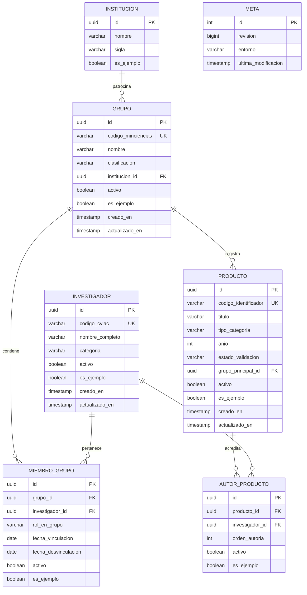

# Contrato de Datos: Esquema Relacional, RPC y Concurrencia en Supabase

## 1. Alcance y Arquitectura de Persistencia

El repositorio remoto de datos de PEA-i es una base de datos PostgreSQL alojada en Supabase accesible exclusivamente a través de su API HTTPS (PostgREST y RPC).

> [!WARNING] Prohibición Expresa de Conexión Directa a Base de Datos
> Queda terminantemente prohibida cualquier conexión directa al puerto TCP 5432 de PostgreSQL o el uso de librerías nativas de conexión tipo `libpq`, `psycopg2` o SQLite local. La persistencia se realiza únicamente por llamadas HTTPS autenticadas.

## 2. Esquema Relacional Canónico

Las migraciones oficiales residen en `supabase/migrations/` y definen las siguientes tablas base estructuradas con identificadores de tipo `UUID` (o códigos de texto oficiales de Minciencias como clave natural secundaria):

### 2.1. Tabla `meta` y Mecanismo de Revisión Optimista
Existe una tabla `meta` con una única fila (`id = 1`) que controla la versión global de los datos:
- `revision`: `BIGINT NOT NULL DEFAULT 1`.
- `entorno`: `VARCHAR(32) NOT NULL DEFAULT 'produccion'`.
- `ultima_modificacion`: `TIMESTAMPTZ NOT NULL DEFAULT NOW()`.

**Trigger por Sentencia**: Cada operación de escritura exitosa (`INSERT`, `UPDATE`, `DELETE`) en cualquiera de las tablas de dominio dispara un trigger de sentencia (`AFTER STATEMENT`) que incrementa `meta.revision = meta.revision + 1` y actualiza `ultima_modificacion = NOW()`.

## 3. Procedimientos Almacenados (RPC) y Transaccionalidad

Para salvaguardar la integridad relacional de operaciones complejas y asegurar atomicidad entre clientes concurrentes, se definen funciones PostgreSQL expuestas como RPC:

### 3.1. `rpc_obtener_revision_actual()`
- **Entrada**: Ninguna.
- **Salida**: `BIGINT` con el número de revisión actual.
- **Uso**: Sondeo periódico de los clientes cada $N$ segundos y verificación previa a operaciones de escritura.

### 3.2. `rpc_transaccion_crear_producto(...)`
- **Parámetros**: Datos completos del producto, lista de IDs de autores con su orden, ID del grupo y `revision_esperada BIGINT`.
- **Lógica**:
  1. Verifica que `meta.revision == revision_esperada`. Si no coincide, aborta y retorna error `CONFLICTO_REVISION`.
  2. Inserta el registro en `productos`.
  3. Inserta los vínculos en `autores_producto`.
  4. La sentencia eleva `meta.revision` automáticamente.

### 3.3. `rpc_transaccion_desactivar_nodo(tipo_nodo, id_nodo, revision_esperada)`
- **Parámetros**: Tipo (`grupo`, `investigador`, `producto`), UUID del registro, `revision_esperada`.
- **Lógica**:
  1. Verifica revisión optimista.
  2. Asigna `activo = FALSE` en el registro y en cascada a sus asociaciones operativas si aplica (reversible).

### 3.4. `rpc_transaccion_eliminar_cascada(tipo_nodo, id_nodo, revision_esperada)`
- **Parámetros**: Tipo, UUID, `revision_esperada`.
- **Lógica**:
  1. Verifica revisión optimista.
  2. Si es producto, elimina sus autores y el nodo producto.
  3. Si es investigador, verifica reglas de integridad: si es único autor de un producto, la eliminación requiere confirmación explícita o elimina el producto en cascada.

## 4. Políticas de Seguridad (RLS - Row Level Security)

Se habilita `ROW LEVEL SECURITY` en el 100% de las tablas:
1. **Lectura (`SELECT`)**:
   - Abierta a clientes con clave publishable (`anon key`) para datos reales (`es_ejemplo = FALSE`).
   - Datos de prueba (`es_ejemplo = TRUE`) visibles solo en sesiones identificadas o mediante filtros explícitos con prefijo `PRUEBA-`.
2. **Escritura Directa (`INSERT`, `UPDATE`, `DELETE`)**:
   - Bloqueada para clientes anónimos en tablas sensibles con relaciones múltiples.
   - Habilitada para el rol de servicio (`authenticated`) mediante token JWT emitido por Supabase Auth.
   - Las operaciones críticas de escritura obligan al paso por las funciones RPC securizadas (`SECURITY DEFINER` con verificación de identidad y revisión).

## 5. Particionamiento de Pruebas (`es_ejemplo = true`)

En concordancia con [[ADR-0002-Unico-proyecto-Supabase]]:
- No existe un clúster separado `pea-test`.
- Las pruebas automáticas operan exclusivamente sobre filas donde `es_ejemplo = TRUE` y cuyo código o título contenga el prefijo `PRUEBA-`.
- Las funciones de limpieza de pruebas (`test_reset()`) ejecutan `DELETE FROM ... WHERE es_ejemplo = true AND codigo LIKE 'PRUEBA-%'`.
- Jamás se tocan ni borran filas de producción (`es_ejemplo = FALSE`) ni los datos de ejemplo precargados oficiales del taller.
