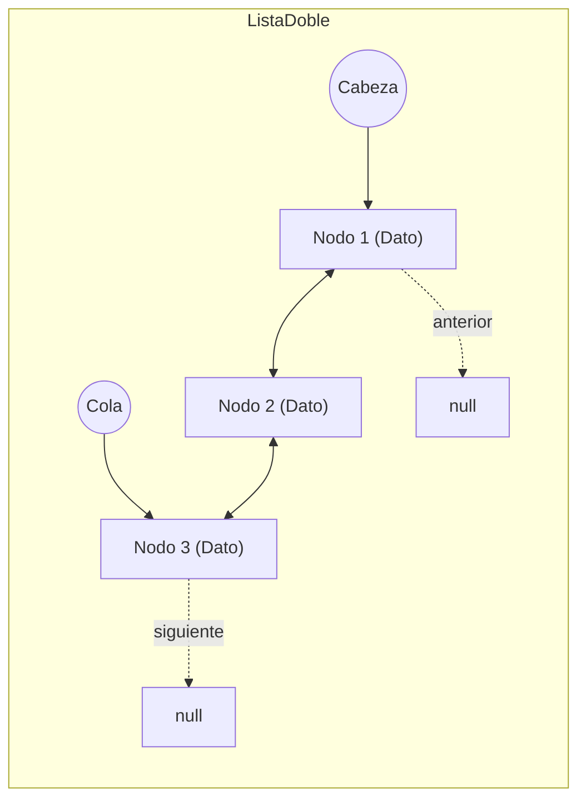

# Diseño · Estructuras de Datos Hechas a Mano

## 1. Propósito y Regla Académica Fundamental

Esta nota establece las directrices comunes de implementación para las estructuras de datos construidas desde cero para **PEA-i**. Conforme al contrato del Taller 2 de Estructuras de Datos de la UPC:

> **Regla de Oro**: Las entidades maestras del dominio (Grupos, Investigadores y Productos) se almacenan y gestionan **exclusivamente** en estructuras hechas a mano. Los contenedores nativos del lenguaje (`list`, `dict` en Python; `std::vector`, `std::map`, `std::unordered_map`, `std::deque` en C++) quedan expresamente prohibidos como almacenamiento principal, permitiéndose únicamente para variables temporales locales o índices auxiliares transitorios.

---

## 2. Inventario de Estructuras del Sistema

| Estructura | Nombre de Clase | Entidad Principal que Gestiona | Disciplina de Acceso | Operaciones Clave |
|---|---|---|---|---|
| **Lista Doblemente Enlazada** | `ListaDoble<T>` | Grupos, Investigadores | Lineal bidireccional | Inserción inicio/fin, búsqueda, eliminación en O(1) de nodo conocido. |
| **Multilista** | `Multilista` | Productos vinculados a Grupos y Autores | Gráfico / Múltiples listas | Navegación cruzada grupo $\leftrightarrow$ producto $\leftrightarrow$ investigadores. |
| **Pila** | `Pila<T>` | Historial de mutaciones (*Deltas Inversos*) | LIFO (*Last-In, First-Out*) | `apilar`, `desapilar`, `tope`, `estaVacia`. Deshacer transaccional. |
| **Cola** | `Cola<T>` | Tareas de importación externa | FIFO (*First-In, First-Out*) | `encolar`, `desencolar`, `frente`. Procesamiento por lotes desatendido. |
| **Hipercubo** | `Hipercubo` | Frecuencias de productos activos | Tensor multidimensional 5D | `slice`, `dice`, `roll-up`, cálculo estadístico en memoria. |

---

## 3. Especificación Técnica de `ListaDoble<T>`

### 3.1 Estructura del Nodo y Cabecera
- **`NodoDoble<T>`**:
  - `dato: T` (o puntero/referencia a la entidad).
  - `anterior: NodoDoble<T>*` (puntero al predecesor).
  - `siguiente: NodoDoble<T>*` (puntero al sucesor).
- **`ListaDoble<T>`**:
  - `cabeza: NodoDoble<T>*` (primer elemento).
  - `cola: NodoDoble<T>*` (último elemento).
  - `tamano: int` (contador de elementos activos).

### 3.2 Invariantes de la Lista Doble
1. Si `tamano == 0` $\iff$ `cabeza == null` $\land$ `cola == null`.
2. Si `tamano == 1` $\iff$ `cabeza == cola` $\land$ `cabeza.anterior == null` $\land$ `cabeza.siguiente == null`.
3. Para cualquier nodo intermedio $N$: $N\text{.siguiente.anterior} == N$ y $N\text{.anterior.siguiente} == N$.

### 3.3 Complejidad Temporal y Espacial

| Operación | Complejidad Temporal | Justificación Algorítmica |
|---|---|---|
| `insertarInicio(dato)` | $O(1)$ | Manipulación de punteros directos sobre `cabeza`. |
| `insertarFinal(dato)` | $O(1)$ | Manipulación de punteros directos sobre `cola`. |
| `eliminarNodo(nodo)` | $O(1)$ | Conociendo el nodo, se reasignan `anterior.siguiente` y `siguiente.anterior`. |
| `buscar(criterio)` | $O(n)$ | Recorrido lineal secuencial desde cabeza. |
| `obtener(indice)` | $O(n)$ | Recorrido optimizado desde cabeza o cola según proximidad. |
| Espacio adicional | $O(n)$ | Dos punteros de enlace por cada nodo. |

---

## 4. Gestión de Memoria y Ciclo de Vida

### 4.1 En Python 3.12
- Se implementan métodos mágicos de iteración: `__iter__`, `__len__`, `__getitem__`.
- Para evitar fugas de memoria por referencias circulares en los punteros dobles, se implementa un método explícito `limpiar()` que rompe los enlaces `anterior` y `siguiente` al destruir la lista.

### 4.2 En C++17
- Implementación mediante clase de plantilla (*template class*) en archivos de cabecera (`ListaDoble.hpp`).
- Cumplimiento riguroso de la **Regla de los Cinco**: Destructor explícito que libera todos los nodos, Constructor de copia, Operador de asignación de copia, Constructor de movimiento y Operador de asignación de movimiento.
- Prohibición de fugas de memoria (*memory leaks*): Verificación estricta mediante pruebas con herramientas de análisis de memoria.

---

## 5. Casos Borde Obligatorios de Prueba
1. Operaciones sobre lista vacía (`cabeza == null`, `tamano == 0`).
2. Inserción y eliminación sobre lista con un único elemento.
3. Eliminación del primer nodo (cabeza) y del último nodo (cola).
4. Eliminación sucesiva hasta vaciar la estructura completa.
5. Inserción masiva de 10,000 elementos para verificar ausencia de desbordamiento de pila.

---

## 6. Decisiones Relacionadas
- [[ADR-0005-Multilista-producto-compartido]]
- [[ADR-0011-Paridad-arquitectural-Python-Cpp]]
