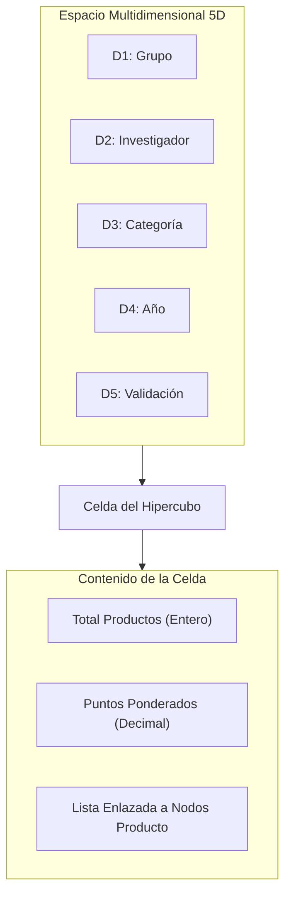

# Hipercubo de Estadísticas en Memoria

## 1. Propósito y Principio Arquitectónico

El **Hipercubo** (o tensor multidimensional) es la estructura de datos hecha a mano responsable de consolidar, calcular y servir todas las métricas estadísticas y agregaciones analíticas de PEA-i en memoria RAM.

> [!IMPORTANT] Regla Normativa Fundamental
> **Las estadísticas de PEA-i se calculan exclusivamente desde el hipercubo en memoria, nunca mediante consultas de agregación SQL (`GROUP BY`, `SUM`, `COUNT`) en Supabase.**
> La base de datos PostgreSQL actúa como repositorio transaccional persistente; la capa de análisis OLAP reside íntegramente en las estructuras nativas de la aplicación cliente (tanto en Python como en C++).

## 2. Dimensiones Canónicas del Hipercubo (5D)

Para satisfacer todos los requisitos de análisis de la [[SPEC]] (R1, R2, R4, R10) y las variables del [[Modelo-2024-original]], el hipercubo se formaliza como un espacio de 5 dimensiones ortogonales:

| Dimensión | Nombre | Tipo / Dominio | Descripción |
|---|---|---|---|
| **D1** | **Grupo** | `ID_Grupo` / Código Minciencias | Agrupación institucional de investigación. |
| **D2** | **Investigador** | `ID_Investigador` / Cédula / Código RH | Persona que produce o co-produce la investigación. |
| **D3** | **Categoría de Producto** | Enum tipológico (`Top`, `A`, `B`, `C`, `Apropiación`, etc.) | Tipología oficial según el Modelo Minciencias 2024. |
| **D4** | **Año de Producción** | Entero (`2000..2030`) | Ventana temporal de obtención o publicación del producto. |
| **D5** | **Estado de Validación** | Enum (`Aprobado`, `EnRevisión`, `Rechazado`, `Inactivo`) | Estado de validez y actividad dentro del sistema. |

## 3. Estructura de Celdas y Representación en Memoria

Para garantizar un uso eficiente de memoria y evitar matrices densas sobredimensionadas donde la mayoría de intersecciones son nulas (matriz dispersa), el hipercubo se diseña con un esquema disperso indexado por tablas hash auxiliares o mapas ortogonales de claves compactas:

1. **Clave de Coordenada (`Coordenada5D`)**:
   - `(id_grupo, id_investigador, categoria_enum, anio_int, estado_enum)` empaquetado en una tupla o estructura hashable.
2. **Valor de Celda (`CeldaHipercubo`)**:
   - `cantidad`: Entero con el conteo total de productos en esa celda.
   - `peso_ponderado`: Flotante con el puntaje acumulado según las reglas de categorización Minciencias.
   - `productos_refs`: Colección enlazada de punteros directos a los nodos `Producto` en la [[Multilista]].

## 4. Operaciones Canónicas de Análisis (OLAP Local)

El servicio de estadísticas (`ServicioEstadisticas`) implementa las siguientes operaciones algebraicas sobre el hipercubo:

### 4.1. Slice (Rebanar)
Fija una dimensión en un valor constante para obtener un subhipercubo de 4 dimensiones.
*Ejemplo*: Obtener toda la producción del año `2023`:
$$\text{Slice}(D_4 = 2023)$$

### 4.2. Dice (Dardear / Subcubo)
Filtra un rango o subconjunto en dos o más dimensiones para aislar un hipervolumen específico.
*Ejemplo*: Productos de categoría `Top` y `A` de los grupos `G1` y `G2` en el periodo `2020..2024`:
$$\text{Dice}(D_1 \in \{G1, G2\} \land D_3 \in \{\text{Top}, A\} \land D_4 \in [2020, 2024])$$

### 4.3. Roll-up (Agregación Jerárquica)
Suma o colapsa dimensiones para generar indicadores a niveles superiores:
- Totalizar la producción de un Grupo sumando todos sus Investigadores y Categorías.
- Calcular la serie temporal interanual de productos por año.

### 4.4. Drill-down (Desagregación)
Desciende desde un consolidado de grupo hasta el desglose individual por investigador o subtipo de producto.

### 4.5. Pivot (Rotación)
Reorganiza los ejes del hipercubo para proyectar matrices 2D destinadas a tablas visuales en la GUI (ej. Filas: Investigadores, Columnas: Años).

## 5. Algoritmo de Construcción e Incrementalidad

El hipercubo no se recalcula desde cero tras cada cambio menor en la aplicación:
1. **Poblado Inicial**: Al iniciar o sincronizar la aplicación, se recorre la [[Multilista]] en $O(N)$ y cada producto inserta sus coordenadas en el hipercubo.
2. **Actualización Incremental**:
   - **Inserción**: Al crear un nuevo producto o vincular un autor, se incrementan las celdas correspondientes en $O(1)$.
   - **Desactivación / Reactivación**: Se decrementan o incrementan las celdas asociadas al estado de validación.
   - **Eliminación / Deshacer**: La [[Pila-deshacer]] aplica las restas inversas sobre las celdas afectadas.

## 6. Paridad de Implementación

- **Python**: Clase `Hipercubo5D` en `pea/core/estructuras/hipercubo.py`. Utiliza diccionarios nativos solo como índices dispersos auxiliares, con nodos de celda propios enlazados.
- **C++**: Clase `Hipercubo5D` en `cpp/src/core/estructuras/hipercubo.hpp`. Utiliza `std::unordered_map` como índice de celdas dispersas con `std::shared_ptr` a nodos de producto.
- Ambos generan idénticos vectores de agregación para alimentar las tarjetas KPI y gráficos de la interfaz gráfica.
