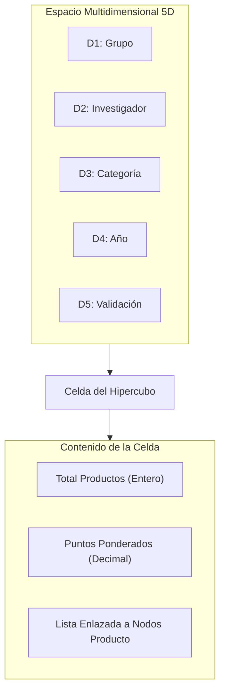
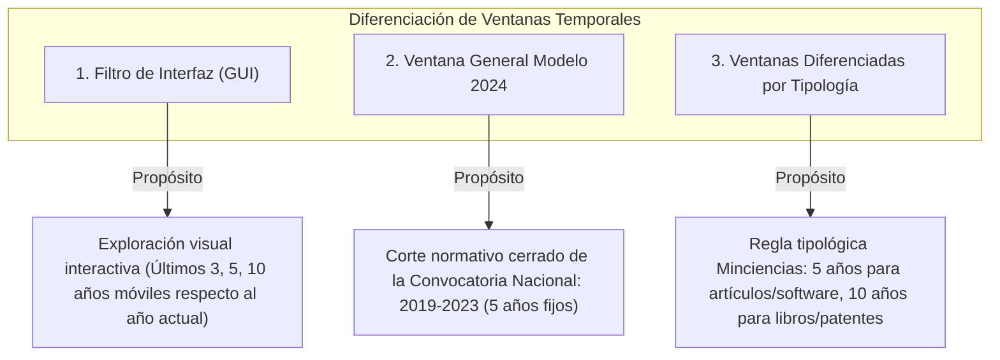

# Hipercubo de Estadísticas en Memoria

## 1. Propósito y Principio Arquitectónico

El **Hipercubo** (o tensor multidimensional) es la estructura de datos hecha a mano responsable de consolidar, calcular y servir todas las métricas estadísticas y agregaciones analíticas de PEA-i en memoria RAM.

> [!IMPORTANT] Regla Normativa Fundamental
> **Las estadísticas de PEA-i se calculan exclusivamente desde el hipercubo en memoria, nunca mediante consultas de agregación SQL (`GROUP BY`, `SUM`, `COUNT`) en Supabase.**
> La base de datos PostgreSQL actúa como repositorio transaccional persistente; la capa de análisis OLAP reside íntegramente en las estructuras nativas de la aplicación cliente (tanto en Python como en C++).

## 2. Dimensiones Canónicas del Hipercubo (5D)

Para satisfacer todos los requisitos de análisis de la [[SPEC]] (R1, R2, R4, R10) y las variables del [[Modelo-2024-original]], el hipercubo se formaliza como un espacio de 5 dimensiones ortogonales:

| Dimensión | Nombre | Tipo / Dominio | Descripción |
|---|---|---|---|
| **D1** | **Grupo** | `ID_Grupo` / Código Minciencias | Agrupación institucional de investigación. |
| **D2** | **Investigador** | `ID_Investigador` / Cédula / Código RH | Persona que produce o co-produce la investigación. |
| **D3** | **Categoría de Producto** | Enum tipológico (`Top`, `A`, `B`, `C`, `Apropiación`, etc.) | Tipología oficial según el Modelo Minciencias 2024. |
| **D4** | **Año de Producción** | Entero (`2000..2030`) | Ventana temporal de obtención o publicación del producto. |
| **D5** | **Estado de Validación** | Enum (`Aprobado`, `EnRevisión`, `Rechazado`, `Inactivo`) | Estado de validez y actividad dentro del sistema. |

## 3. Estructura de Celdas y Representación en Memoria

Para garantizar un uso eficiente de memoria y evitar matrices densas sobredimensionadas donde la mayoría de intersecciones son nulas (matriz dispersa), el hipercubo se diseña con un esquema disperso indexado por tablas hash auxiliares o mapas ortogonales de claves compactas:

1. **Clave de Coordenada (`Coordenada5D`)**:
   - `(id_grupo, id_investigador, categoria_enum, anio_int, estado_enum)` empaquetado en una tupla o estructura hashable.
2. **Valor de Celda (`CeldaHipercubo`)**:
   - `cantidad`: Entero con el conteo total de productos en esa celda.
   - `peso_ponderado`: Flotante con el puntaje acumulado según las reglas de categorización Minciencias.
   - `productos_refs`: Colección enlazada de punteros directos a los nodos `Producto` en la [[Multilista]].

## 4. Operaciones Canónicas de Análisis (OLAP Local)

El servicio de estadísticas (`ServicioEstadisticas`) implementa las siguientes operaciones algebraicas sobre el hipercubo:

### 4.1. Slice (Rebanar)
Fija una dimensión en un valor constante para obtener un subhipercubo de 4 dimensiones.
*Ejemplo*: Obtener toda la producción del año `2023`:
$$\text{Slice}(D_4 = 2023)$$

### 4.2. Dice (Dardear / Subcubo)
Filtra un rango o subconjunto en dos o más dimensiones para aislar un hipervolumen específico.
*Ejemplo*: Productos de categoría `Top` y `A` de los grupos `G1` y `G2` en el periodo `2020..2024`:
$$\text{Dice}(D_1 \in \{G1, G2\} \land D_3 \in \{\text{Top}, A\} \land D_4 \in [2020, 2024])$$

### 4.3. Roll-up (Agregación Jerárquica)
Suma o colapsa dimensiones para generar indicadores a niveles superiores:
- Totalizar la producción de un Grupo sumando todos sus Investigadores y Categorías.
- Calcular la serie temporal interanual de productos por año.

### 4.4. Drill-down (Desagregación)
Desciende desde un consolidado de grupo hasta el desglose individual por investigador o subtipo de producto.

### 4.5. Pivot (Rotación)
Reorganiza los ejes del hipercubo para proyectar matrices 2D destinadas a tablas visuales en la GUI (ej. Filas: Investigadores, Columnas: Años).

## 5. Algoritmo de Construcción e Incrementalidad

El hipercubo no se recalcula desde cero tras cada cambio menor en la aplicación:
1. **Poblado Inicial**: Al iniciar o sincronizar la aplicación, se recorre la [[Multilista]] en $O(N)$ y cada producto inserta sus coordenadas en el hipercubo.
2. **Actualización Incremental**:
   - **Inserción**: Al crear un nuevo producto o vincular un autor, se incrementan las celdas correspondientes en $O(1)$.
   - **Desactivación / Reactivación**: Se decrementan o incrementan las celdas asociadas al estado de validación.
   - **Eliminación / Deshacer**: La [[Pila-deshacer]] aplica las restas inversas sobre las celdas afectadas.

## 6. Paridad de Implementación

- **Python**: 
  - Estructura: `Hipercubo5D` en `src/pea/estructuras/hipercubo.py`. Utiliza `ListaDoble[CeldaHipercubo]` para la preservación secuencial y diccionarios nativos exclusivamente como índice hash auxiliar O(1) conforme a [[ADR-0006-Hipercubo-estadisticas-en-memoria]].
  - Servicio: `ServicioEstadisticas` en `src/pea/servicios/servicio_estadisticas.py`.
- **C++**: 
  - Estructura: `Hipercubo5D` en `cpp/include/pea/estructuras/hipercubo.hpp`. Utiliza `ListaDoble<CeldaHipercubo>` y `QHash<Coordenada5D, CeldaHipercubo*>` como índice hash auxiliar.
  - Servicio: `ServicioEstadisticas` en `cpp/include/pea/servicios/servicio_estadisticas.hpp` y `cpp/src/servicios/servicio_estadisticas.cpp`.
- Ambos generan idénticos resultados numéricos byte-a-byte, validados contra pruebas automáticas unitarias y oráculos de verificación relacional.

## 7. Ventanas Temporales: Diferenciación Crítica de Dominios

> [!WARNING] Advertencia Normativa contra Confusión Conceptual
> **La ventana genérica "últimos N años" del sistema NO debe confundirse con la ventana específica de la convocatoria 2024 ni con las ventanas diferenciadas por tipología del Modelo Minciencias.**

Para evitar ambigüedades arquitectónicas y fallos de cálculo, PEA-i distingue formalmente tres niveles de acotación temporal:

### 7.1. Filtro de Interfaz (Ventana Genérica "Últimos N Años")
- **Naturaleza**: Parámetro dinámico e interactivo configurable por el usuario en la interfaz gráfica (ej. selector "Últimos 3 años", "Últimos 5 años", "Últimos 10 años").
- **Ámbito temporal**: Relativo al reloj de la máquina o año de referencia actual ($[\text{año\_actual} - N + 1, \text{año\_actual}]$).
- **Comportamiento**: Es **simétrico e indiferenciado**; aplica el mismo corte a todas las tipologías sin distinción de naturaleza documental.
- **Implementación**: Operación de subcubo `subcubo_por_ventana(anio_inicio, anio_fin)`.

### 7.2. Ventana General del Modelo Minciencias (Convocatoria 2024)
- **Naturaleza**: Periodo formal estático establecido en los Términos de Referencia de la Convocatoria Nacional de Medición de Grupos y Reconocimiento de Investigadores del año 2024 ([[Modelo-2024-original#Página 12088]]).
- **Ámbito temporal**: **1 de enero de 2019 al 31 de diciembre de 2023** (años cerrados `[2019, 2023]`).
- **Comportamiento**: Fecha de corte estática e inmutable. La producción posterior a 2023 o anterior a 2019 queda por fuera de la vigencia estándar de la convocatoria, con independencia del año en que se ejecute el software.

### 7.3. Ventanas Diferenciadas por Tipología de Producto (Modelo 2024)
- **Naturaleza**: Reglas de vigencia documental específicas del Modelo Minciencias según la maduración y vida útil de cada tipología de producto ([[Modelo-Productos#2. Tipologías y Pesos Relativos]], [[Modelo-Grupos#3. Ventana de Observación y Escala Logarítmica]]):
  1. **Ventana Estándar de 5 Años (`[2019, 2023]` para corte 2023)**:
     - **GNC**: Artículos de investigación en revistas indexadas (A1, A2, B, C, D) y notas científicas.
     - **DTI**: Diseños industriales, software registrado y certificado, plantas piloto, prototipos industriales, signos distintivos e innovaciones en gestión.
     - **ASC / DPC**: Procesos de apropiación social, publicaciones de divulgación y estrategias transmedia.
     - **FRH**: Trabajos de grado de maestría y trabajos de pregrado.
  2. **Ventana Ampliada de 10 Años (`[2014, 2023]` para corte 2023)**:
     - **GNC**: Libros resultado de investigación (A1, B), capítulos en libros de investigación, patentes de invención concedidas, patentes de modelo de utilidad concedidas, variedades vegetales y nuevas razas animales.
  3. **Trayectoria Vital / Ventana Extendida para Investigadores**:
     - Dirección de tesis doctorales concluidas y producción cumbre histórica considerada en la categorización de Investigadores Sénior e Investigadores Eméritos ([[Modelo-Investigadores#3. Ventana de Observación para Investigadores]]).
- **Implementación**: Método especializado `subcubo_modelo_2024(anio_corte=2023)` que evalúa la tipología de cada celda y aplica la cota de 5 o 10 años según corresponda.

---

## 8. Las Tres Vistas Analíticas Oficiales

El `ServicioEstadisticas` materializa las tres proyecciones multidimensionales canónicas que alimentan el panel de control y las fichas de detalle en la GUI:

### 8.1. Vista 1: Vista Institucional (Panorámica Universitaria)
- **Objetivo**: Brindar a las vicerrectorías de investigación la fotografía global del desempeño institucional.
- **Contenido**:
  - Total de productos activos en la institución.
  - Distribución absoluta y porcentual por categoría mayor (GNC, DTI, ASC, FRH).
  - Evolución temporal interanual (serie histórica de productos por año).
  - Estado general de validaciones institucionales (Avalado, Con soporte, No avalado).
  - **Top 5 Investigadores** con mayor producción acumulada (con desempate determinista).
  - **Top 5 Grupos** con mayor volumen científico.
  - Promedio global de productos por investigador.

### 8.2. Vista 2: Vista por Grupo de Investigación (Ficha Analítica Grupal)
- **Objetivo**: Diagnóstico individual del grupo para procesos de acreditación y autoevaluación.
- **Contenido**:
  - Total de productos propios del grupo.
  - Porcentaje que representa la producción del grupo respecto a toda la universidad.
  - Desglose por tipología y evolución cronológica del grupo.
  - Lista de investigadores vinculados con sus aportes individuales al grupo.
  - **Top 5 Investigadores del Grupo**.
  - Promedio de productos por investigador dentro del grupo.

### 8.3. Vista 3: Vista por Investigador (Ficha Analítica Individual de Autoría)
- **Objetivo**: Hoja de ruta científica y perfil de producción de cada docente/investigador.
- **Contenido**:
  - Total de productos científicos de su autoría o coautoría.
  - Distribución de su producción por categoría y año.
  - Estado de validación de sus productos.
  - Lista de grupos de investigación en los que participa y **porcentaje de contribución** respecto a la producción total de cada grupo.
