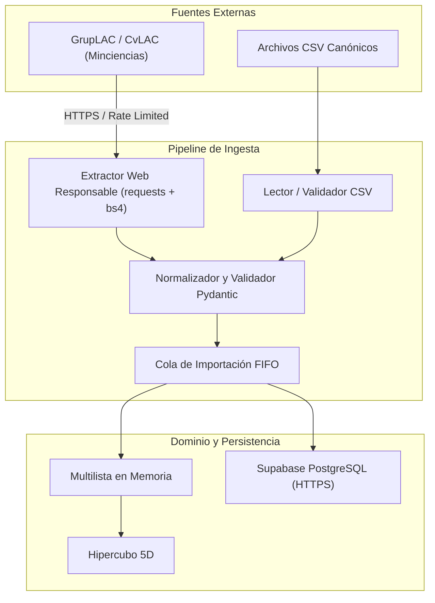

# Ingesta de Datos: Extracción Web SCIENTI e Importación de Archivos

## 1. Principio y Vías de Entrada

La ingesta de datos en PEA-i proporciona la información de grupos, investigadores y productos requerida para el análisis. Se contemplan dos canales oficiales de alimentación:
- **Vía A (Extracción Web SCIENTI)**: Descarga directa desde los portales oficiales GrupLAC y CvLAC de Minciencias.
- **Vía B (Archivos Tabulares Canónicos)**: Importación estructurada mediante archivos CSV o exportaciones estandarizadas.



## 2. Vía A: Extracción Web Responsable (SCIENTI)

El scraping web está sujeto a las reglas estrictas de [[ADR-0010-Limites-y-responsabilidad-de-ingesta]]:
1. **Dominios Permitidos**: Exclusivamente `scienti.minciencias.gov.co`. Cualquier intento hacia otros dominios se bloquea.
2. **Protocolo Seguro**: Conexiones forzadas por `HTTPS`.
3. **Identificación Institucional (User-Agent)**:
   ```http
   User-Agent: PEA-i/1.0 (Universidad Popular del Cesar; Taller Estructura de Datos; contacto@unicesar.edu.co)
   ```
4. **Respeto al Servidor y Pausas**:
   - Pausa obligatoria mínima de **1.0 segundo** entre peticiones sucesivas.
   - Máximo **3 reintentos** automáticos ante fallos 5xx con retroceso exponencial (*exponential backoff*: 2s, 4s, 8s).
   - Tiempo de espera máximo (*timeout*) de 15 segundos por solicitud.
5. **Caché Local de Respuestas**:
   - Todo documento HTML extraído se almacena en `datos/cache/<hash_url>.html` junto a sus metadatos HTTP en JSON.
   - Si la caché es válida (vigencia configurable, por defecto 24 horas), no se reitera la petición de red.
6. **Resiliencia ante Fallos**:
   - Si Minciencias cambia su estructura HTML o el servicio está fuera de línea, la aplicación no colapsa: atrapa el error, informa al usuario con un mensaje claro y propone como alternativa la carga vía archivo CSV.

## 3. Vía B: Importación por Archivos Tabulares (CSV)

Para contingencias sin conexión o migraciones masivas, PEA-i define un formato canónico de 4 archivos CSV (codificados en UTF-8 sin BOM, delimitador por coma `,` y comillas dobles para texto):

### 3.1. `grupos.csv`
```csv
codigo_minciencias,nombre,clasificacion,institucion
COL0008543,Grupo de Investigación en Tecnologías de Información,A1,Universidad Popular del Cesar
```

### 3.2. `investigadores.csv`
```csv
codigo_cvlac,nombre_completo,categoria,nacionalidad
0000494917,Pérez Juan Carlos,Investigador Senior (IS),Colombia
```

### 3.3. `productos.csv`
```csv
codigo_identificador,titulo,tipo_categoria,anio,estado_validacion,grupo_codigo
ART-2023-001,Análisis de Grafos en Redes Complejas,Artículo Tipo A1,2023,Aprobado,COL0008543
```

### 3.4. `autores.csv`
```csv
producto_codigo,investigador_codigo,orden_autoria
ART-2023-001,0000494917,1
```

## 4. Normalización, Detección de Duplicados y Desduplicación

Antes de que un elemento ingrese en la [[Cola-importacion]], se aplican las siguientes reglas:
1. **Limpieza de Cadenas**: Eliminación de espacios redundantes, normalización Unicode NFC, sustitución de caracteres invisibles o saltos de línea huérfanos.
2. **Detección de Duplicados**:
   - Para Grupos: Por `codigo_minciencias`.
   - Para Investigadores: Por `codigo_cvlac`.
   - Para Productos: Por identificador natural normalizado (`DOI` o combinación `titulo_normalizado + anio`).
3. **Resolución de Conflictos**:
   - Si el registro ya existe en la [[Multilista]], no se duplica el nodo: se actualizan sus metadatos más recientes y se enlazan los nuevos autores si no estaban acreditados.
   - Cada inserción genera el evento correspondiente para encolar la persistencia y notificar a la GUI.
