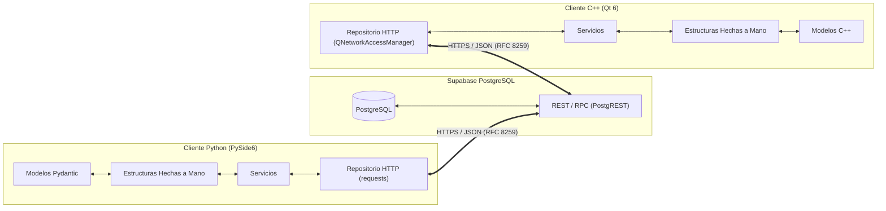

# Interoperabilidad y Paridad Funcional Python / C++

## 1. Alcance y Principio de Paridad

PEA-i se compone de dos implementaciones independientes de escritorio:
- **Python 3.12** utilizando **PySide6** (Qt 6 for Python).
- **C++17** utilizando **Qt 6 Widgets** compilado con MinGW-w64 (MSYS2 UCRT64).

Ambas aplicaciones comparten la misma base de datos remota en Supabase, los mismos contratos de red y las mismas estructuras de datos fundamentales hechas a mano.

> [!IMPORTANT] Principio de Equivalencia Observacional
> Para cualquier conjunto de datos dado $D$, la aplicación en Python y la aplicación en C++ deben:
> 1. Producir exactamente las mismas representaciones en memoria dentro de la [[Multilista]] y el [[Hipercubo]].
> 2. Calcular los mismos valores numéricos para todos los indicadores de productividad y estadísticas OLAP.
> 3. Enviar y recibir cargas útiles JSON idénticas a la API de Supabase.

## 2. Contrato de Datos JSON (RFC 8259)

Todas las comunicaciones REST, llamadas RPC y archivos de exportación/caché se rigen por las siguientes convenciones estándar:

| Tipo de Dato | Representación JSON | Formato / Regla |
|---|---|---|
| **Identificadores** | `String` | Formato canónico UUIDv4 en minúsculas: `xxxxxxxx-xxxx-4xxx-yxxx-xxxxxxxxxxxx`. |
| **Fechas y Horas** | `String` | Estándar ISO 8601 con zona horaria UTC: `YYYY-MM-DDTHH:MM:SSZ` (ej. `2026-10-03T12:00:00Z`). |
| **Fechas Solas** | `String` | Formato `YYYY-MM-DD` (ej. `2024-05-18`). |
| **Valores Numéricos** | `Number` | Enteros o flotantes estándar; sin separadores de miles, punto decimal (`.` ). |
| **Valores Nulos** | `null` | Representa ausencia de valor; nunca cadenas vacías `" "` ni valores centinela `-1`. |
| **Claves de Objeto** | `String` | Formato `snake_case` estricto en la API y base de datos (ej. `codigo_cvlac`, `es_ejemplo`). |

## 3. Mapeo Tipológico entre Lenguajes

| Entidad / Campo | PostgreSQL (Supabase) | Python 3.12 (Pydantic / Dataclass) | C++17 (Qt 6) |
|---|---|---|---|
| `id` | `UUID` | `uuid.UUID` / `str` | `QUuid` / `QString` |
| `nombre` | `VARCHAR` | `str` | `QString` |
| `anio` | `INTEGER` | `int` | `int` |
| `activo` | `BOOLEAN` | `bool` | `bool` |
| `categoria` | `VARCHAR` (Enum) | `Enum` (derivado de `str`) | `enum class` en C++ |
| `peso_ponderado` | `NUMERIC(8,2)` | `float` / `Decimal` | `double` |
| `revision` | `BIGINT` | `int` | `qint64` |

## 4. Oráculo de Validación Canónico (`esperado.json`)

Para verificar que ambas implementaciones resuelven los algoritmos de la misma forma, el repositorio incluye un oráculo en `tests/fixtures/esperado.json`:
1. **Entrada de Prueba**: Conjunto de 3 grupos, 15 investigadores y 50 productos con coautorías cruzadas.
2. **Resultados Esperados**:
   - Total de nodos creados en la [[Multilista]] (grupos, investigadores, productos y aristas de coautoría).
   - Matriz 5D resultante del [[Hipercubo]] (conteos por celda y sumatorias ponderadas).
   - Indicadores de red (grado de entrada, grado de salida, nodos aislados).
3. **Mecanismo de Evaluación**:
   - `pytest` ejecuta el cálculo en Python y compara contra `esperado.json`.
   - `ctest` ejecuta el cálculo en C++ y compara contra el mismo `esperado.json`.
   - La suite solo se considera verde si ambos arrojan un margen de discrepancia de $0.0\%$.

## 5. Manejo de Errores y Códigos de Estado

Ambas aplicaciones traducen las respuestas HTTP de Supabase a una jerarquía común de excepciones / códigos de retorno:

| Código HTTP / Error | Categoría Interna | Acción en Cliente |
|---|---|---|
| `200`, `201`, `204` | `Exito` | Aplicar cambios a estructuras locales. |
| `401`, `403` | `ErrorAutenticacion` | Notificar expiración de sesión y solicitar credenciales. |
| `409` | `ConflictoRevision` | Notificar "La base de datos cambió" y bloquear guardado hasta recargar. |
| `0` / Timeout / Red | `ErrorConexion` | Entrar en modo lectura y activar indicador de sin conexión. |
