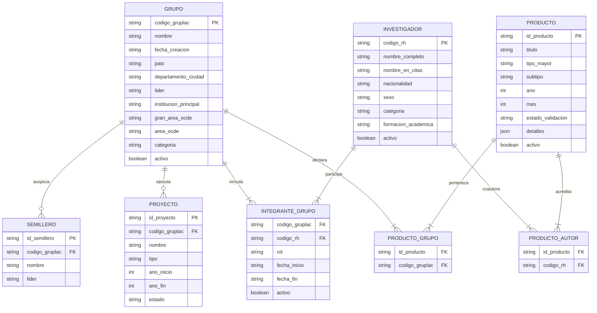

# Diseño · Modelo de Dominio Conceptual

## 1. Propósito

Esta nota formaliza el modelo conceptual del dominio de **PEA-i**, definiendo las entidades maestras, atributos normalizados, cardinalidades y reglas normativas basadas en el **Modelo Minciencias 2024** y las extracciones de **SCIENTI** (GrupLAC y CvLAC).

---

## 2. Diagrama Conceptual de Entidades y Relaciones

---

## 3. Entidades Nucleares del Dominio

### 3.1 Grupo de Investigación (`Grupo`)
- **Propósito**: Representa la unidad fundamental de investigación avalada institucionalmente.
- **Clave Primaria**: `codigo_gruplac` (cadena única de la plataforma Minciencias).
- **Reglas del Modelo**:
  - Debe contar con al menos un integrante en rol `Líder` activo en todo momento ([[Modelo-Grupos#Condiciones de existencia de un Grupo de Investigación]]).
  - Categorías permitidas: `A1`, `A`, `B`, `C` o `Reconocido`.
  - Debe pertenecer a una de las 6 Grandes Áreas OCDE y a una de sus 42 subáreas normalizadas ([[Modelo-Areas-OCDE]]).

### 3.2 Investigador (`Investigador`)
- **Propósito**: Hoja de vida de la persona natural que produce ciencia y tecnología registrada en CvLAC.
- **Clave Primaria**: `codigo_rh` (código de currículo CvLAC).
- **Reglas del Modelo**:
  - Categorías oficiales: `Investigador Emérito`, `Investigador Senior`, `Investigador Asociado`, `Investigador Junior` o `Sin categoría / Vinculado` ([[Modelo-Investigadores]]).
  - Formación máxima: `Doctorado`, `Maestría`, `Especialización`, `Pregrado`.

### 3.3 Vinculación de Integrante (`IntegranteGrupo`)
- **Propósito**: Relación temporal de membresía entre un Investigador y un Grupo de Investigación.
- **Atributos Clave**: Rol (`Líder`, `Investigador`, `Estudiante`), `fecha_inicio` y `fecha_fin`.
- **Regla**: Un investigador puede tener membresía en múltiples grupos simultáneamente o en periodos sucesivos.

### 3.4 Producto de Investigación (`Producto`)
- **Propósito**: Resultado formal de CTeI obtenido por uno o más investigadores y declarado por uno o más grupos.
- **Tipologías Mayores (Modelo 2024)**:
  1. **GNC**: Generación de Nuevo Conocimiento (Artículos A1-B, Libros, Capítulos, Patentes).
  2. **DTI**: Desarrollo Tecnológico e Innovación (Software, Diseños, Prototipos, Plantas piloto).
  3. **ASC**: Apropiación Social del Conocimiento y Divulgación Pública de la Ciencia.
  4. **FRH**: Formación de Recurso Humano (Tesis doctorales, Trabajos de maestría, Trabajos de pregrado).
- **Estados de Validación**: `Avalado`, `Con soporte`, `No avalado`.
- **Regla Cardinal de la Multilista**: Cada producto se representa en memoria como **un único objeto** enlazado a sus autores y grupo.

---

## 4. Clasificación de Entidades: Núcleo vs. Vistas Secundarias

Para garantizar el cumplimiento de los plazos académicos y evitar la sobrecarga del esquema relacional, se formaliza la siguiente distinción conforme a [[ADR-0013-Vistas-secundarias]]:

| Entidad | Clasificación | Justificación y Manejo |
|---|---|---|
| **Grupo, Investigador, Integrante, Producto** | **Núcleo Obligatorio (P0)** | Entidades requeridas por el enunciado del taller, indispensables para el Hipercubo y la Multilista. |
| **Proyecto** | **Vista Secundaria (P2)** | Aparece en el boceto visual. Se modela a partir de los proyectos que expone GrupLAC, sin afectar los conteos del Hipercubo. |
| **Semillero** | **Vista Secundaria (P2)** | Aparece en el boceto visual. Se modela como vista informativa institucional. No bloquea el núcleo. |
| **Centro** | **Vista Agrupadora (P3)** | Agrupación institucional de consulta en la interfaz. |

---

## 5. Decisiones Relacionadas
- [[ADR-0005-Multilista-producto-compartido]]
- [[ADR-0013-Vistas-secundarias]]
- [[ADR-0014-Nomenclatura-del-dominio-y-base-de-datos]]

---

## 6. Riesgos y Casos Borde
- **Investigador sin productos**: Válido en el dominio (ej. estudiante en formación o investigador reciente).
- **Producto con múltiples grupos**: El modelo soporta relación $M:N$ mediante `producto_grupos` para colaboraciones interinstitucionales avaladas.
- **Desactivación de integrantes**: Al desactivar un integrante (`activo=false`), sus productos históricos no se borran del grupo si fueron generados durante su periodo de vinculación.
