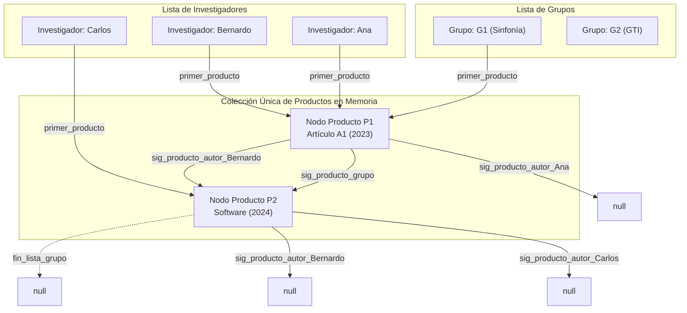

# Diseño · Multilista de Productos y Coautorías

## 1. Propósito y Principio del Nodo Único Compartido

La **Multilista** es la estructura de datos no lineal más importante de **PEA-i**. Modela la relación $M:N$ del mundo real entre Grupos, Productos e Investigadores asegurando un principio inviolable:

> **Principio de Identidad de Objeto**: Cada producto de investigación existe en la memoria del programa como **un único nodo lógico**. No se permiten copias ni réplicas del objeto `Producto`. Si un artículo tiene 4 coautores y pertenece a 1 grupo, los 4 investigadores y el grupo apuntan concurrentemente a la misma instancia física en memoria.

---

## 2. Diagrama Estructural de la Multilista



---

## 3. Representación Algorítmica de Nodos

### 3.1 Nodo de Coautoría (`NodoAutorProducto`)
Dado que un producto puede tener una cantidad arbitraria de autores, cada autor se vincula mediante un nodo de cruce o una lista enlazada de punteros de autoría:
```text
NodoAutorProducto:
  - investigador: Investigador* (referencia al autor)
  - siguiente_autor: NodoAutorProducto* (siguiente coautor del mismo producto)
  - siguiente_producto_de_este_autor: Producto* (siguiente producto en la lista personal del autor)
```

### 3.2 Nodo Principal de Producto (`NodoProducto`)
```text
NodoProducto:
  - entidad: Producto (atributos: id, titulo, tipo_mayor, ano, activo...)
  - grupo_declarante: Grupo* (puntero al grupo principal)
  - anterior_en_grupo: NodoProducto*
  - siguiente_en_grupo: NodoProducto*
  - lista_autores: NodoAutorProducto* (cabeza de la lista de autores)
```

---

## 4. Invariantes de Consistencia de la Multilista

1. **Invariante de Pertenencia Mínima**: Todo nodo `Producto` en la multilista debe tener:
   - Al menos 1 puntero entrante válido desde un `Grupo`.
   - Al menos 1 puntero entrante válido desde un `Investigador` (el autor principal o líder).
2. **Invariante de Identidad Reactiva**: La modificación de cualquier campo del nodo `Producto` (ej. cambio de estado de validación a `Avalado`) debe observarse de forma inmediata e idéntica al navegar desde la ficha del grupo y desde las hojas de vida de todos los coautores, verificándose mediante identidad de punteros (`id(p)` en Python o `&p` en C++).
3. **Invariante de Desvinculación Limpia**: Al eliminar o desenlazar un producto, se deben actualizar los punteros de los predecesores y sucesores en la lista del grupo y en las listas de **todos** sus coautores, impidiendo la existencia de punteros colgantes (*dangling pointers*).

---

## 5. Operaciones Fundamentales

### 5.1 Inserción de Producto con Coautores
- **Entrada**: Datos del producto, puntero al `Grupo` y colección de punteros a `Investigadores` coautores.
- **Procedimiento**:
  1. Instanciar el nodo `NodoProducto` con los datos suministrados.
  2. Insertar el nodo al final de la lista de productos del `Grupo` en $O(1)$.
  3. Para cada investigador coautor: crear un `NodoAutorProducto`, enlazarlo a la lista de autores del producto y conectarlo a la lista de productos del investigador en $O(1)$.
  4. Actualizar el `Hipercubo` sumando 1 en la coordenada $(g, i, c, a, v)$ para cada coautor.

### 5.2 Eliminación Física en Cascada Controlada
- **Regla**: Si un producto se elimina físicamente:
  1. Se recorre su lista de autores desenlazando el producto de la lista personal de cada investigador.
  2. Se desenlaza de la lista de productos del grupo.
  3. Se descuenta del `Hipercubo`.
  4. Se libera la memoria física del nodo.

### 5.3 Desactivación Lógica (`activo = false`)
- **Procedimiento**: No se altera ningún puntero de la multilista. Se conmuta `entidad.activo = false` y se descuentan las frecuencias del `Hipercubo`. El producto sigue siendo navegable pero se etiqueta visualmente como "Inactivo".

---

## 6. Base para el Análisis de Redes de Coautoría

La Multilista constituye la fuente de verdad directa para construir el **Grafo de Coautorías**:
- Dos investigadores $I_1$ e $I_2$ poseen una arista de colaboración en el grafo si y solo si existe al menos un nodo `Producto` en la multilista que contenga a ambos en su lista de autores.
- El peso de la arista $w(I_1, I_2)$ es exactamente la cantidad de nodos `Producto` activos compartidos.
- Esto permite calcular métricas de centralidad, grado de intermediación y grupos de colaboración directamente desde la memoria sin consultas externas.

---

## 7. Decisiones Relacionadas
- [[ADR-0005-Multilista-producto-compartido]]
- [[ADR-0015-Analisis-de-red-nativo]]
