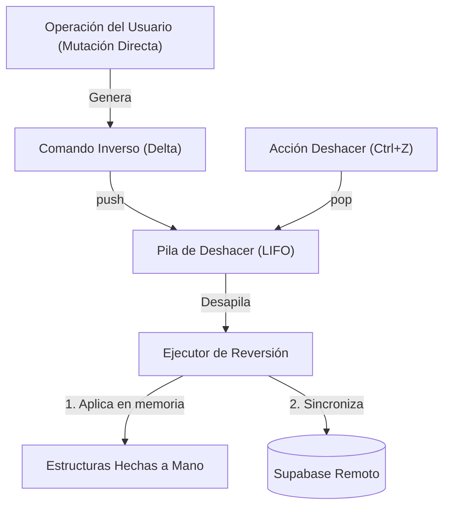

# Diseño · Pila de Deshacer Transaccional (Undo Stack)

## 1. Propósito

Esta nota formaliza la estructura de datos **Pila (LIFO)** hecha a mano encargada de gestionar el historial de reversión de operaciones (Deshacer / *Undo*, atajo Ctrl+Z). Permite restituir de forma determinista el estado previo de las estructuras en memoria y sincronizar la compensación correspondiente con la base de datos remota Supabase.

---

## 2. Modelo de Comando Inverso (Delta Inverso)

Para optimizar el uso de memoria RAM y evitar clonar colecciones completas en cada mutación, la pila implementa el patrón **Command con Delta Inverso**:

### Catálogo de Operaciones y sus Deltas Inversos

| Operación Directa Ejecutada | Información Almacenada en la Pila | Acción del Delta Inverso al Deshacer |
|---|---|---|
| **Crear Producto** | Tipo entidad, `id_producto` creado | Invoca `eliminarProducto(id_producto)` en memoria y envía `DELETE` a Supabase. |
| **Editar Datos de Entidad** | Tipo entidad, identificador, `{campo: valor_anterior}` | Restaura los valores previos en el nodo y envía `PATCH` a Supabase. |
| **Desactivar Entidad** | Tipo entidad, identificador | Conmuta `activo = true`, reincorpora al Hipercubo y envía `PATCH /activo=true`. |
| **Activar Entidad** | Tipo entidad, identificador | Conmuta `activo = false`, descuenta del Hipercubo y envía `PATCH /activo=false`. |
| **Eliminar Físico Permitido** | Snapshot completo del nodo y lista de vínculos de autoría | Reinserta el nodo en la lista/multilista y envía llamada RPC de recreación. |

---

## 3. Especificación Técnica de la Pila

### 3.1 Estructura del Nodo y Métodos
- **`NodoPila<T>`**:
  - `comando: T` (instancia de `ComandoInverso`).
  - `siguiente: NodoPila<T>*` (puntero al elemento inferior en la pila).
- **`Pila<T>`**:
  - `tope: NodoPila<T>*` (referencia al elemento superior disponible).
  - `tamano: int` (profundidad actual del historial).
  - `capacidad_maxima: int = 50` (límite configurable de niveles de deshacer).

### 3.2 Invariantes de la Pila
1. La pila opera estrictamente bajo la disciplina **LIFO** (*Last-In, First-Out*).
2. Si `tamano == 0` $\iff$ `tope == null`. La acción "Deshacer" en la GUI se encuentra deshabilitada.
3. Si la pila alcanza `capacidad_maxima`, el elemento más antiguo (ubicado en el fondo) se descarta silenciosamente para prevenir consumo excesivo de memoria.

---

## 4. Protocolo de Deshacer y Resiliencia con Supabase

El proceso de deshacer involucra una transacción dual (memoria local y base remota):

1. **Extracción**: El usuario presiona Ctrl+Z o pulsa "Deshacer". Se desapila el comando inverso del `tope`.
2. **Aplicación Local**: Se aplica la mutación inversa sobre la `ListaDoble`, `Multilista` o `Hipercubo`.
3. **Persistencia Remota**: Se despacha la llamada REST o RPC hacia Supabase pasando la `revision_esperada`.
4. **Manejo de Conflictos de Concurrencia**:
   - Si la persistencia es aceptada: Se actualiza `meta.revision` y la GUI se refresca.
   - Si la persistencia es rechazada (ej. por error de red o porque otro usuario modificó la entidad concurrentemente):
     - La capa de servicios aborta la reversión.
     - Se reaplica la operación directa original sobre la memoria para evitar desincronización.
     - Se presenta la alerta al usuario: *"No se pudo deshacer la operación debido a un cambio concurrente en la base de datos"*.

---

## 5. Casos Borde Obligatorios de Prueba
1. Invocación de `deshacer()` cuando la pila está vacía (debe ser una operación no-op segura).
2. Deshacer consecutivo de múltiples operaciones hasta vaciar la pila.
3. Deshacer una desactivación de un producto y comprobar que reaparece instantáneamente en el Hipercubo y en los gráficos del panel.
4. Deshacer cuando la conexión a internet se ha perdido (debe bloquear la mutación y preservar consistencia).

---

## 6. Decisiones Relacionadas
- [[ADR-0007-Compensacion-de-persistencia-reversion]]
- [[ADR-0009-RPC-y-control-de-revision-optimista]]
