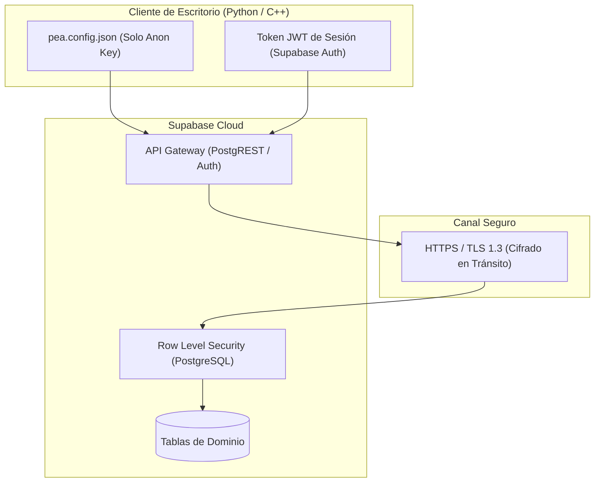

# Seguridad, Credenciales y Gestión de Entornos

## 1. Principios de Seguridad y Superficie de Ataque

El diseño de seguridad de PEA-i responde a un modelo de aplicación cliente de escritorio distribuida que consume servicios en la nube:

> [!CAUTION] Prohibición Absoluta de Claves Secretas
> **Jamás** se debe compilar, empaquetar, commitear ni escribir en notas la clave de servicio (`service_role` o `sb_secret_*`), la contraseña de administración de la base de datos o tokens maestros de Supabase.
> Los clientes de escritorio operan exclusivamente con la **clave publicable** (`anon key` / publishable key) y tokens JWT temporales de usuario emitidos por Supabase Auth.

## 2. Modelo de Conexión de Red

1. **Protocolo Exclusivo**: Todas las comunicaciones utilizan HTTPS sobre TLS 1.3.
2. **Cero Conexiones Directas a PostgreSQL**: Ningún cliente se conecta al puerto `5432` ni emplea controladores de bajo nivel de base de datos (`libpq`, ODBC, JDBC).
3. **Validación de Certificados**: Tanto Python (`requests` con `certifi`) como C++ (`QSslSocket` con el almacén del sistema y librerías OpenSSL) validan estrictamente las cadenas de certificados X.509 de la CA remota.

## 3. Autenticación y Autorización (Supabase Auth y RLS)

1. **Autenticación de Usuarios**:
   - Inicio de sesión mediante `POST /auth/v1/token?grant_type=password` con credenciales de usuario (correo institucional y contraseña).
   - Recepción de un `access_token` JWT firmado con vigencia limitada y un `refresh_token` para renovación silenciosa.
2. **Control de Acceso Basado en Filas (RLS)**:
   - Toda tabla tiene RLS activado.
   - Si no hay usuario autenticado, PostgREST aplica el rol `anon`, permitiendo únicamente lecturas públicas de datos consolidados.
   - Las escrituras (`INSERT`, `UPDATE`, `DELETE`) exigen el rol `authenticated` con el UID del usuario registrado en las políticas.
   - Las modificaciones transversales a múltiples tablas se canalizan forzosamente a través de funciones RPC con comprobación de permisos.

## 4. Política de Proyecto Único y Datos de Prueba

En concordancia con [[ADR-0002-Unico-proyecto-Supabase]]:
- Existe un único proyecto de Supabase: `pea-prod`.
- No existe ni se permite la creación de un proyecto `pea-test`.
- **Modo Prueba**:
  - Las suites de prueba automática marcan sus registros con `es_ejemplo = TRUE`.
  - Todo registro de prueba lleva el prefijo obligatorio `PRUEBA-` en sus códigos, nombres y títulos (ej. `PRUEBA-COL0008543`, `PRUEBA-0000494917`).
  - La rutina de limpieza (`reiniciar_prueba.py` / `test_reset()`) autentica con la cuenta de pruebas autorizada y ejecuta borrado condicional `WHERE es_ejemplo = TRUE AND codigo LIKE 'PRUEBA-%'`.
  - Las filas reales (`es_ejemplo = FALSE`) y los datos de ejemplo precargados oficiales están protegidos y nunca son eliminados por las pruebas.

## 5. Protección de Datos Personales (Investigadores)

En cumplimiento de [[ADR-0004-Privacidad-de-fuentes-reales]]:
- Los datos personales de investigadores (documentos de identidad, teléfonos, correos personales) se consideran estrictamente privados.
- El repositorio git y las notas públicas de Obsidian en `brain/` no alojan datos personales reales de CvLAC no autorizados.
- Las pruebas automatizadas utilizan exclusivamente fixtures anonimizados y sintéticos ubicados en `tests/fixtures/`.
- La información de producción descargada se protege mediante políticas RLS y acceso controlado.
