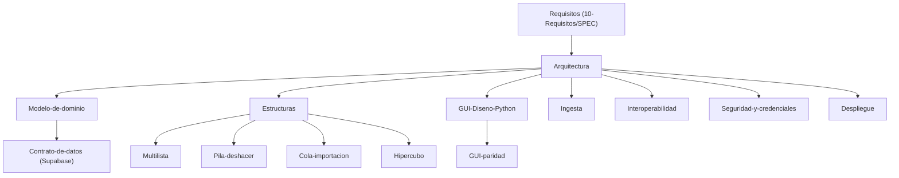

# Índice de Arquitectura y Diseño Formal · PEA-i

Este módulo formaliza las especificaciones arquitecturales, técnicas, de datos y algorítmicas de **PEA-i**. Define rigurosamente la separación de capas, el diseño de estructuras de datos hechas a mano, la persistencia en Supabase, el protocolo de sincronización y la paridad de la interfaz gráfica entre Python y C++.

---

## 1. Documentos de Diseño

| Documento | Descripción | Tipo | Estado |
|---|---|---|---|
| [[Arquitectura]] | Pipeline en capas canónico: GUI → Servicios → Estructuras → Repositorios → HTTPS → Supabase. | `nota-de-diseno` | Aprobado |
| [[Modelo-de-dominio]] | Modelo conceptual de entidades (Grupo, Investigador, Integrante, Producto) y tipologías Minciencias. | `nota-de-diseno` | Aprobado |
| [[Estructuras]] | Fundamentos de estructuras hechas a mano, invariantes, gestión de memoria y reglas de no contenedores nativos. | `nota-de-diseno` | Aprobado |
| [[Multilista]] | Nodo único compartido de Producto enlazado simultáneamente a Grupos y múltiples Investigadores coautores. | `nota-de-diseno` | Aprobado |
| [[Pila-deshacer]] | Pila LIFO transaccional basada en comandos inversos (Deltas Inversos) y sincronización con Supabase. | `nota-de-diseno` | Aprobado |
| [[Cola-importacion]] | Cola FIFO con máquina de estados para ingesta por lotes de fuentes web (SCIENTI) y archivos CSV. | `nota-de-diseno` | Aprobado |
| [[Hipercubo]] | Tensor multidimensional 5D disperso para el cálculo analítico de estadísticas en memoria (slice, dice, roll-up). | `nota-de-diseno` | Aprobado |
| [[Contrato-de-datos]] | Esquema relacional PostgreSQL, tipos, constraints, funciones RPC transaccionales y control `meta.revision`. | `nota-de-diseno` | Aprobado |
| [[Interoperabilidad]] | Serialización JSON, oráculos comparativos y equivalencia funcional estricta entre Python 3.12 y C++17. | `nota-de-diseno` | Aprobado |
| [[Ingesta]] | Pipeline de scraping web responsable (SCIENTI) y procesador de archivos CSV canónicos. | `nota-de-diseno` | Aprobado |
| [[GUI-Diseno-Python]] | **Fuente de verdad visual** de la interfaz de Python: tokens, ventana, siete pantallas, componentes, gráficos, estados y criterios de aceptación. | `nota-de-diseno` | Revisado |
| [[Plan-de-prompts-GUI-Python]] | Secuencia de prompts (00 a 15) para rehacer la interfaz de Python con el agente. | `nota-de-diseno` | Revisado |
| [[GUI-paridad]] | Contrato visual y funcional que C++ deberá igualar cuando se rediseñe (pendiente). | `nota-de-diseno` | Revisado |
| [[Seguridad-y-credenciales]] | Conexión HTTPS TLS 1.3, clave publishable, políticas de Row Level Security (RLS) y aislamiento de pruebas. | `nota-de-diseno` | Aprobado |
| [[Despliegue]] | Empaquetado Windows desatendido (PyInstaller para Python, CMake + windeployqt para C++) y configuración. | `nota-de-diseno` | Aprobado |

---

## 2. Mapa Conceptual de Diseño

