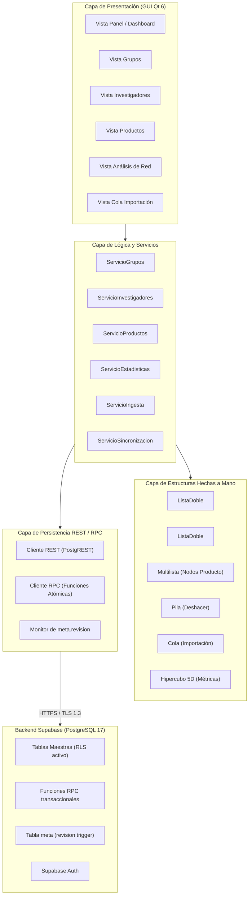

# Auditoría integral del diseño PEA-i

## 1. Estado actual

El proyecto **PEA-i** (Programa Estadístico de Análisis de Investigación - Taller 2 de Estructuras de Datos, Universidad Popular del Cesar) se encuentra en la transición exacta entre la fase de formalización de requisitos (**A3**) y la fase de diseño formal (**A4**). 

### Evidencia del repositorio
- **Historial de Git**: Rama `master` con 7 commits consolidados (`0cd28b1` como HEAD). Árbol de trabajo completamente limpio.
- **Corpus del Modelo 2024**: Las 252 páginas del documento oficial Minciencias M601PR04G01 están transcritas íntegramente en `docs/entrada/` y `brain/40-Fuentes/`, con 6 notas temáticas normalizadas y el mapa general `Modelo-2024-indice.md`.
- **Ingesta SCIENTI**: Plataforma de scraping funcional en `tools/fuentes/` con modelos Pydantic v2, pruebas unitarias offline con fixtures (`test_extraer_scienti.py` 100% verde), mapa de campos de 52 selectores y separación de capturas entre `publicado/` y `privado/`.
- **Cerebro de Requisitos**: 8 documentos técnicos en `brain/10-Requisitos/` con trazabilidad completa de R0–R12 y C1–C6, glosario canónico, diccionario de variables y matriz de verificación. Bóveda validada al 100% con `verificar_brain.py` (0 errores, 0 advertencias).
- **Vacíos Detectados**: No existe aún código ejecutable de la aplicación de usuario (`python/` y `cpp/` no existen); `supabase/migrations/` no existe; las carpetas `brain/20-Diseno/` y `brain/30-Decisiones/` están vacías.

---

## 2. Diseño actualmente definido

El diseño definido en la documentación viva de la bóveda (`AGENTS.md` y `brain/10-Requisitos/SPEC.md`) establece una arquitectura cliente-servidor desacoplada por capas:

$$\text{GUI} \longrightarrow \text{Servicios} \longrightarrow \text{Estructuras Propias} \longrightarrow \text{Repositorios REST/RPC} \longrightarrow \text{HTTPS} \longrightarrow \text{Supabase (PostgreSQL)}$$

### Principios Fundamentales Definidos
1. **Doble Implementación con Paridad Funcional**: Una aplicación en **Python 3.12 (PySide6)** y una en **C++17 (Qt 6 Widgets)**, compartiendo el mismo comportamiento visual y la misma base de datos remota.
2. **Estructuras de Datos Propias Hechas a Mano**: Las colecciones maestras no utilizan contenedores nativos del lenguaje (`list`, `dict`, `std::vector`, `std::map`). Se definen cinco estructuras:
   - `ListaDoble`: Almacenamiento lineal para Grupos e Investigadores.
   - `Multilista`: Nodo único de `Producto` compartido simultáneamente por su Grupo y sus Investigadores autores.
   - `Pila`: Registro LIFO de deltas inversos para reversión transaccional (Deshacer / Undo).
   - `Cola`: Procesamiento FIFO por lotes de tareas de ingesta (URLs y CSVs).
   - `Hipercubo`: Tensor 5D (Grupo $\times$ Investigador $\times$ Categoría $\times$ Año $\times$ Validación) para conteos de productos activos.
3. **Confinamiento Estadístico**: Todas las estadísticas se calculan algorítmicamente sobre el Hipercubo en memoria (`slice`, `dice`, `roll-up`), prohibiendo consultas SQL agregadas (`GROUP BY`) contra Supabase.
4. **Persistencia Atómica y Resiliencia**: Operaciones compuestas mediante RPCs en PostgreSQL. Si la red falla, la capa de Servicios revierte la mutación aplicada en memoria. Control de concurrencia optimista mediante `meta.revision`.

---

## 3. Diseño actualmente implementado

A nivel de código ejecutable, el diseño implementado está circunscrito a las herramientas de apoyo e ingesta:
1. **Herramientas de Ingesta y Parsing**:
   - `tools/fuentes/descargar_scienti.py`: Cliente HTTPS con rate-limiting (pausa de 1 s), límite de 3 reintentos con backoff exponencial y almacenamiento en `datos/cache/`.
   - `tools/fuentes/extraer_scienti.py`: Parser modular sobre BeautifulSoup4 y lxml.
   - `tools/fuentes/modelos_scienti.py`: Modelos tipados de validación en Pydantic (`GrupoScienti`, `InvestigadorScienti`, `ProductoScienti`, `IntegranteScienti`).
2. **Herramientas de Procesamiento de Corpus**:
   - `tools/modelo/procesar_modelo_2024.py` y `tools/modelo/probar_completitud.py`: Procesador de PDF mediante `pdfplumber` y suite de validación de 252 páginas.
3. **Herramientas de Bóveda y Salvaguarda**:
   - `tools/brain/verificar_brain.py`: Validador estricto de YAML, enlaces y formatos, equipado con detección y auto-recuperación de archivos vacíos (`--restaurar`).
   - `.git/hooks/pre-commit`: Hook de Git que impide commitear archivos de 0 bytes y valida la bóveda antes del commit.
   - `scripts/restaurar.ps1`: Script PowerShell de auto-rescate en un solo paso.
4. **Lo que NO está implementado aún**:
   - No hay implementación de clases de estructuras de datos (`ListaDoble`, `Multilista`, `Hipercubo`, `Pila`, `Cola`).
   - No hay código de la capa de Servicios ni Repositorios.
   - No hay código de interfaz GUI ni en PySide6 ni en C++.
   - No hay migraciones SQL ni funciones RPC en Supabase.

---

## 4. Diseño objetivo

El diseño objetivo busca reconciliar la rigurosidad formal del **Taller de Estructuras de Datos de la UPC** con el marco normativo del **Modelo Minciencias 2024** y la experiencia de usuario moderna de un sistema de gestión científica.

### Dimensiones del Diseño Objetivo
- **Independencia de Capas**: Aislamiento estricto de responsabilidades. La GUI desconoce la existencia de Supabase, de HTTPS y de la memoria física de los nodos; solo invoca contratos de Servicios.
- **Unicidad de Datos en Memoria**: Eliminación radical de redundancia mediante la Multilista. Un producto que pertenece a 3 investigadores y a 1 grupo existe en una sola dirección de memoria.
- **Sincronización Transaccional Robusta**: Persistencia remota vía HTTPS a través de un único proyecto `pea-prod`, garantizando que dos instancias abiertas concurrentemente (incluso una en Python y otra en C++) mantengan consistencia mediante `meta.revision`.

---

## 5. Diseño visual objetivo

A partir de los requerimientos de interfaz y la referencia visual de diseño de escritorio:

### Barra Superior (Header Navigation)
- Fondo oscuro en tonalidad azul institucional (`#1a2a40` / `#0f172a`).
- Identidad visual UPC: Logo oficial de la Universidad Popular del Cesar a la izquierda, título del sistema **PEA-i**.
- Pestañas de navegación principal con iconos y texto en español:
  - **Inicio** (Panel general / Resumen).
  - **Investigadores** (Directorio, perfil y producción).
  - **Grupos** (Ficha institucional, líneas y vinculaciones).
  - **Productos** (Inventario clasificado GNC, DTI, ASC, FRH).
  - **Análisis de Redes** (Grafo interactivo de coautoría y centralidad).
  - **Importación** (Cola de procesamiento por lotes).
  - **Configuración** (Conexión Supabase, estado de red y revisión).
  - **Acerca de** (Integrantes, Grupo 8, créditos).
- Sección derecha: Indicador de estado de conexión ("En línea" / "Desconectado"), badge de `meta.revision`, botón "Deshacer" (Ctrl+Z) y perfil.

### Pantalla Inicio (Panel Principal)
- **Tarjetas de Resumen (KPIs)**: Tarjetas blancas con bordes redondeados y sombra sutil:
  - Total de Investigadores Activos.
  - Total de Grupos Avalados.
  - Total de Productos Activos.
  - Indicador de Cohesión / Cooperación Global.
- **Gráficos Integrados**:
  - Distribución tipológica de productos (gráfico de torta o dona: GNC, DTI, ASC, FRH).
  - Evolución histórica de producción (gráfico de barras por año).
  - Vista previa del grafo de red de colaboración del grupo.

### Pantalla Investigadores y Grupos
- **Vista Dividida (*Split View*)**:
  - Panel izquierdo / central: Tabla con buscador reactivo, filtros por categoría Minciencias y año, paginación local.
  - Panel lateral derecho retráctil: Ficha técnica detallada del investigador o grupo seleccionado (foto/icono, código RH/GrupLAC, formación máxima, vinculaciones y lista de productos).

### Pantalla Análisis de Red (Coautoría)
- Visualización interactiva del grafo de relaciones donde los nodos son Investigadores y las aristas representan coautorías en la Multilista.
- Controles de filtrado: Umbral mínimo de coautorías, agrupación por grupo y métricas de centralidad/grado.

---

## 6. Diseño técnico objetivo

### Invariantes del Diseño Técnico
1. **Invariante de la Multilista**: Todo producto registrado en la multilista debe tener al menos un puntero entrante desde un `Grupo` y al menos un puntero entrante desde un `Investigador`.
2. **Invariante del Hipercubo**: La sumatoria total del hipercubo sobre todas sus dimensiones debe ser idéntica a la cantidad de nodos `Producto` en la multilista con `activo=true`.
3. **Invariante de Persistencia**: Ninguna mutación en memoria se considera definitiva sin la confirmación de Supabase; ante error HTTP, se dispara compensación automática desapilando o revirtiendo el nodo en memoria.

---

## 7. Contradicciones encontradas

| # | Elemento en Conflicto | Fuente 1 (Contradictoria) | Fuente 2 (Canónica) | Severidad | Impacto |
|---|---|---|---|---|---|
| **C-01** | Disposición de Navegación GUI | `SPEC.md:RF-11` describe "Barra Lateral de Navegación". | Boceto visual objetivo especifica "Barra Superior Azul Oscura" con pestañas. | Media | La GUI debe adoptar la barra superior como menú primario y barras laterales solo para detalles/filtros de entidad. |
| **C-02** | Ruta de Skills en Contrato | `AGENTS.md:51` dice `.agents/skills/`. | Git commit `49433f7` renombró el directorio a `.agent/skills/`. | Media | Puede confundir a agentes que busquen herramientas en rutas inexistentes. |
| **C-03** | Variable de Clave Secreta en Ejemplo | `.env.example:6` contiene `PEA_SUPABASE_SECRET_TEST=`. | `AGENTS.md` prohíbe tajantemente el uso de claves secretas en cualquier entorno. | Alta | Riesgo de que un desarrollador introduzca por error la clave `service_role`. |
| **C-04** | Duplicación en Agente GUI | `.opencode/agents/gui.md:25-50` duplica el texto completo de las líneas 1-24. | `.opencode/protocolos/` exige formato limpio y conciso. | Baja | Desprolijidad que incrementa el uso de tokens sin añadir valor. |
| **C-05** | Configuración de Exposición en Supabase | `supabase/config.toml:23` tiene `# auto_expose_new_tables = true` comentado (activo por defecto). | `.agent/skills/postgresql-supabase/SKILL.md` exige grants explícitos y mínimo privilegio. | Media | Nuevas tablas podrían quedar expuestas a roles públicos sin RLS estricto. |
| **C-06** | Referencias a Entidades Secundarias en GUI | El boceto visual muestra pestañas para "Semilleros", "Proyectos", "Centros". | El enunciado y `SPEC.md` concentran el núcleo obligatorio en Grupos, Investigadores e Integrantes y Productos. | Media | Riesgo de dispersión: se deben mantener como vistas secundarias o supuestos sin sobrecargar el modelo de datos. |
| **C-07** | Puerta de Implementación en Comandos | `.opencode/commands/implementar.md` exige `brain/20-Diseno/Contrato-de-datos.md`. | En `brain/20-Diseno/` no existe aún ningún archivo. | Alta | Impide que el comando de implementación corra hasta que la fase A4 cree el documento. |
| **C-08** | Inexistencia del script de verificación | `.agent/workflows/verificar.md` cita `scripts/verificar.ps1`. | En `scripts/` actualmente solo existe `restaurar.ps1`. | Media | El flujo de verificación falla si no se crea el script unificado. |
| **C-09** | Enfoque de Pruebas destructivas | Documentación previa hablaba de `test_reset()` total. | `AGENTS.md` (Proyecto único) exige que las pruebas solo limpien filas `PRUEBA-` con `es_ejemplo=true`. | Alta | Evita borrar accidentalmente datos reales o de ejemplo oficial. |
| **C-10** | Manejo de Estado en Cascada de Investigadores | Pregunta abierta #2 sin cerrar: eliminar físico vs desactivar lógico. | `SPEC.md:RNF-06` establece que todo cambio debe ser reversible. | Alta | Necesidad de formalizar la regla de bloqueo si un investigador es único autor. |

---

## 8. Diseños obsoletos

1. **Diseño de Dos Proyectos Supabase (`pea-prod` y `pea-test`)**: Obsoleto. El diseño oficial es un único proyecto `pea-prod` operando en modo prueba con aislamiento de prefijos `PRUEBA-`.
2. **Uso de Claves Administrativas (`service_role` / `sb_secret`)**: Obsoleto y prohibido. Toda interacción del cliente usa Auth y la clave publicable (*publishable*).
3. **Uso de Contenedores Estándar como Repositorios Principales**: Obsoleto. Toda entidad vive en estructuras propias hechas a mano.
4. **Cálculo de Indicadores vía SQL `GROUP BY`**: Obsoleto. Las estadísticas se calculan estrictamente en memoria desde el Hipercubo.
5. **Página HTML como Modelo Minciencias**: Obsoleto. La fuente normativa oficial es el PDF 2024 de 252 páginas procesado.

---

## 9. Elementos a conservar

1. **Contrato de AGENTS.md**: Las reglas de capas, estructuras hechas a mano, PostgreSQL único y verificación.
2. **Corpus Normativo del Modelo 2024**: [`Modelo-2024-original.md`](file:///c:/dev/PEAi-Taller2/brain/40-Fuentes/Modelo-2024-original.md), índice y 6 notas temáticas.
3. **Módulo de Extracción SCIENTI**: Scripts en `tools/fuentes/`, modelos Pydantic v2 y fixtures de prueba offline.
4. **Especificación de Requisitos**: Los 13 RFs y 6 RNFs de [`SPEC.md`](file:///c:/dev/PEAi-Taller2/brain/10-Requisitos/SPEC.md), Glosario y Matriz de trazabilidad.
5. **Salvaguardas de Repositorio**: Hook `pre-commit`, configuración de VS Code y script `scripts/restaurar.ps1`.

---

## 10. Elementos a modificar

1. **`brain/00-Inicio.md`**: Actualizar la sección de Diseño una vez que se pueble `brain/20-Diseno/`.
2. **`AGENTS.md`**: Corregir la errata de ruta `.agents/skills/` por `.agent/skills/`.
3. **`.env.example`**: Eliminar la línea 6 `PEA_SUPABASE_SECRET_TEST=`.
4. **`.opencode/agents/gui.md`**: Remover el bloque de texto duplicado.
5. **`supabase/config.toml`**: Descomentar `auto_expose_new_tables = false` para forzar el principio de mínimo privilegio.

---

## 11. Archivos afectados

| Archivo | Motivo | Prioridad |
|---|---|---|
| `AGENTS.md` | Corregir ruta de `.agents/` a `.agent/`. | P1 |
| `.env.example` | Retirar variable de clave secret prohibida. | P1 |
| `.opencode/agents/gui.md` | Eliminar contenido duplicado. | P2 |
| `supabase/config.toml` | Ajustar seguridad de exposición de tablas. | P1 |
| `scripts/verificar.ps1` | Crear script unificado de compilación y pruebas. | P0 |

---

## 12. Cerebro de Obsidian afectado

Para completar la fase A4 de diseño formal, el cerebro debe poblarse con 14 notas de diseño en `brain/20-Diseno/` y 11 notas ADR en `brain/30-Decisiones/`:

### Notas a Crear en `brain/20-Diseno/`
1. `20-Diseno/_Indice.md`: Índice general de arquitectura y diseño.
2. `20-Diseno/Arquitectura.md`: Diagrama de capas, responsabilidades y flujo cliente-servidor.
3. `20-Diseno/Modelo-de-dominio.md`: Entidades, atributos, cardinalidades y reglas de negocio.
4. `20-Diseno/Estructuras.md`: Principios comunes de estructuras hechas a mano y gestión de memoria.
5. `20-Diseno/Multilista.md`: Diseño detallado de nodo compartido, punteros dobles y operaciones cruzadas.
6. `20-Diseno/Pila-deshacer.md`: Diseño del registro LIFO y patrón Command/Delta Inverso.
7. `20-Diseno/Cola-importacion.md`: Diseño del despachador FIFO y máquina de estados de tareas.
8. `20-Diseno/Hipercubo.md`: Diseño del tensor 5D disperso, algoritmos `slice`, `dice`, `roll-up`.
9. `20-Diseno/Contrato-de-datos.md`: Esquema relacional Supabase, tipos, constraints y RLS.
10. `20-Diseno/Interoperabilidad.md`: Contrato de serialización JSON y paridad funcional Python/C++.
11. `20-Diseno/Ingesta.md`: Pipeline de captura, normalización y carga desde URLs y CSVs.
12. `20-Diseno/GUI-paridad.md`: Especificación de interfaz (barra superior azul, tarjetas, gráficos, paneles).
13. `20-Diseno/Seguridad-y-credenciales.md`: Gestión de tokens, RLS, clave publishable y aislamiento.
14. `20-Diseno/Despliegue.md`: Empaquetado Windows (PyInstaller, windeployqt) y configuración local.

### Notas ADR a Crear en `brain/30-Decisiones/`
- `ADR-0001-Boveda-viva.md`
- `ADR-0002-Unico-proyecto-Supabase.md`
- `ADR-0003-Corpus-fiel-del-Modelo.md`
- `ADR-0004-Privacidad-de-fuentes-reales.md`
- `ADR-0005-Multilista-producto-compartido.md`
- `ADR-0006-Hipercubo-estadisticas-en-memoria.md`
- `ADR-0007-Compensacion-de-persistencia-reversion.md`
- `ADR-0008-Modelo-de-autenticacion-y-rls.md`
- `ADR-0009-RPC-y-control-de-revision-optimista.md`
- `ADR-0010-Limites-y-responsabilidad-de-ingesta.md`
- `ADR-0011-Paridad-arquitectural-Python-Cpp.md`

---

## 13. Prompts afectados

- Prompts heredados o plantillas iniciales que hacían referencia a un repositorio vacío deben actualizarse para operar reconociendo el trabajo previo en `docs/entrada/`, `brain/` y `tools/`.
- Cualquier prompt que mencione `pea-test` como una segunda base o mencione claves secretas debe ser sustituido por el protocolo de un único proyecto con aislamiento de prefijo `PRUEBA-`.

---

## 14. Agentes afectados

- `arquitecto.md`: Será el encargado principal de generar la documentación de `brain/20-Diseno/` y `brain/30-Decisiones/`.
- `gui.md`: Debe ser actualizado eliminando la duplicación de texto y adoptando formalmente la especificación de la barra superior azul y split-views.
- `datos.md`: Actuará en A5 una vez que `Contrato-de-datos.md` esté formalizado.

---

## 15. Supabase afectado

- Proyecto enlazado: `wdmchsncexayqbjueamb` (pea-prod).
- En la fase A5 se requerirá generar las migraciones en `supabase/migrations/`:
  - `001_meta_y_revision.sql`: Tabla de metadatos, columna `revision` y triggers de incremento.
  - `002_tablas_dominio.sql`: `grupos`, `investigadores`, `integrantes`, `productos`, `producto_autores`, `producto_grupos`.
  - `003_rls_politicas.sql`: Políticas de acceso para usuarios autenticados y aislamiento de filas de prueba.
  - `004_funciones_rpc.sql`: Funciones de escritura atómica multi-tabla con validación de `revision_esperada`.
  - `005_semillas_prueba.sql`: Datos ficticios anonimizados con prefijo `PRUEBA-` y `es_ejemplo=true`.

---

## 16. Riesgos de modificación

1. **Riesgo de Regresión en Documentación Existente**: Modificar notas consolidadas de requisitos o fuentes podría romper enlaces wikilinks validados.
   - *Mitigación*: Validación obligatoria con `verificar_brain.py` antes de cualquier commit.
2. **Riesgo de Desincronización entre Python y C++**: Diseñar estructuras con comportamientos sutilmente distintos (ej. diferencias en semántica de punteros o tipos numéricos).
   - *Mitigación*: Documentar el contrato exacto de invariantes y pruebas de contrato con oráculos JSON idénticos.
3. **Riesgo de Inconsistencia en Supabase**: Aplicar migraciones no probadas en local o sin dry-run.
   - *Mitigación*: Protocolo estricto de respaldo con `tools/db/respaldar.py` y confirmación explícita del usuario.

---

## 17. Diseño Freeze propuesto

Se propone congelar formalmente las siguientes decisiones arquitecturales para las siguientes etapas:

1. **Pipeline Arquitectural**:
   $$\text{GUI (PySide6 / Qt6)} \xrightarrow{\text{Eventos}} \text{Servicios} \xrightarrow{\text{Mutación}} \text{Estructuras Hechas a Mano} \xrightarrow{\text{Persistencia}} \text{Repositorios} \xrightarrow{\text{HTTPS}} \text{Supabase}$$
2. **Estructuras Principales Inmutables**:
   - `ListaDoble`: Almacena Grupos e Investigadores.
   - `Multilista`: Nodo único `Producto` compartido.
   - `Pila`: Deshacer transaccional con deltas inversos.
   - `Cola`: Ingesta FIFO con máquina de estados.
   - `Hipercubo`: Agregaciones analíticas 5D en memoria.
3. **Backend y Concurrencia**:
   - Un solo proyecto Supabase (`pea-prod`).
   - Cero conexiones directas al puerto 5432 (solo HTTPS REST/RPC).
   - Clave publishable única en clientes; RLS activo en todas las tablas.
   - Concurrencia controlada por `meta.revision`.

---

## 18. Plan exacto para el segundo prompt (A4-D2: Materialización del Diseño)

El siguiente prompt (`A4-D2`) deberá materializar la documentación formal del diseño sin escribir código ejecutable de la aplicación, siguiendo este orden riguroso:

1. **Paso 1: Crear notas de diseño en `brain/20-Diseno/`**:
   - Redactar los 14 documentos detallados con diagramas mermaid, complejidades asintóticas y casos borde.
2. **Paso 2: Crear el registro de ADRs en `brain/30-Decisiones/`**:
   - Crear los 11 documentos consecutivos (`ADR-0001` a `ADR-0011`).
3. **Paso 3: Actualizar correcciones menores detectadas**:
   - Corregir ruta en `AGENTS.md:51`.
   - Limpiar `PEA_SUPABASE_SECRET_TEST` en `.env.example`.
   - Limpiar duplicado en `.opencode/agents/gui.md`.
4. **Paso 4: Verificación y Cierre**:
   - Ejecutar `tools/brain/verificar_brain.py` garantizando 0 errores y 0 advertencias.
   - Bitácora de sesión y commit: `docs: diseno formal y decisiones de arquitectura`.

---

## 19. Criterios de aceptación

- [ ] Las 14 notas de diseño en `brain/20-Diseno/` existen y cumplen con la plantilla `Nota-de-diseno`.
- [ ] Las 11 notas ADR en `brain/30-Decisiones/` existen y cumplen con la plantilla `ADR`.
- [ ] Todos los diagramas de arquitectura, estructuras y flujos están en sintaxis mermaid válida.
- [ ] El diseño de la GUI especifica la barra superior azul institucional, tarjetas de resumen, gráficos embebidos y vista de grafo de coautoría.
- [ ] La bóveda completa es validada por `python tools/brain/verificar_brain.py` con 0 errores y 0 advertencias.
- [ ] Ninguna línea de código de negocio o esquema de base de datos ha sido implementada antes de la aprobación del diseño.

---

## 20. Preguntas abiertas

1. **Grafo de Coautorías en C++**: En Python se puede utilizar `networkx` o renderizado nativo con `matplotlib` / `QPainter`. En C++, ¿confirmas que el grafo de coautorías se implementará mediante renderizado personalizado sobre `QGraphicsScene` / `QPainter` para no requerir bibliotecas pesadas externas?
2. **Vistas Secundarias (Proyectos / Semilleros)**: ¿Confirmas que las pestañas de "Proyectos" y "Semilleros" visibles en el boceto se mantendrán como vistas de segundo nivel pobladas a partir de los datos que GrupLAC exponga, sin ser requisito bloqueante para las estadísticas del Hipercubo?
3. **Esquema de Nombres en Base de Datos**: ¿Prefieres nomenclatura en español estricto sin tildes para tablas y columnas en Supabase (`grupos`, `investigadores`, `productos`, `integrantes`, `codigo_rh`, `activo`), alineada con el contrato del dominio?
